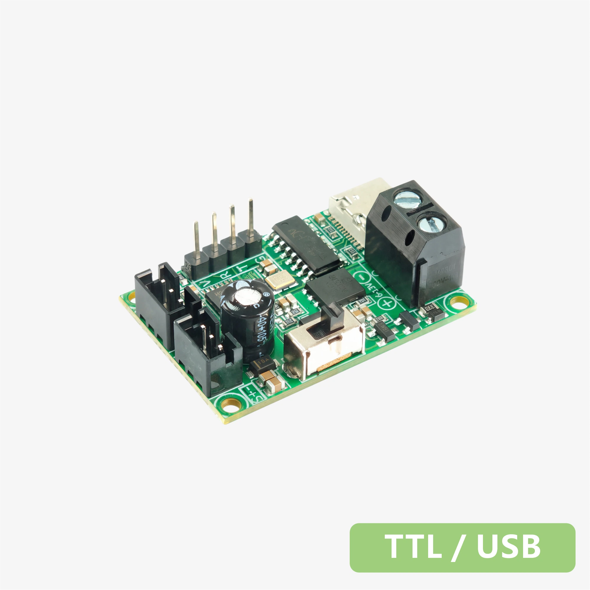
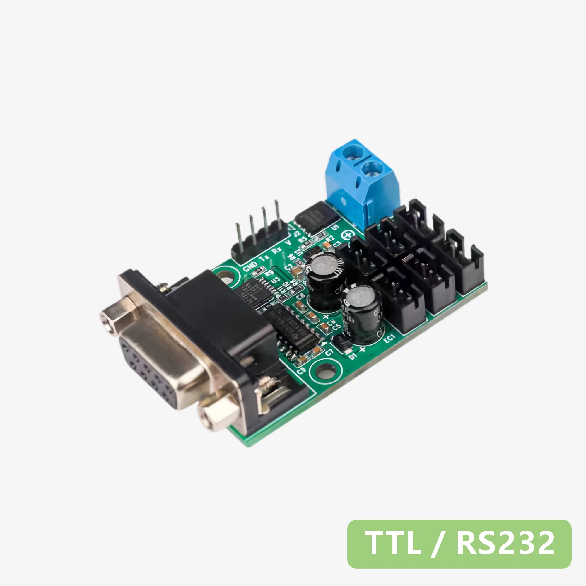
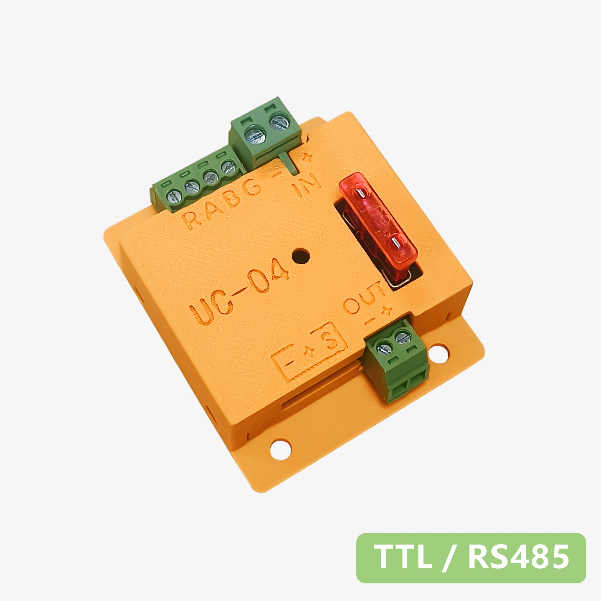
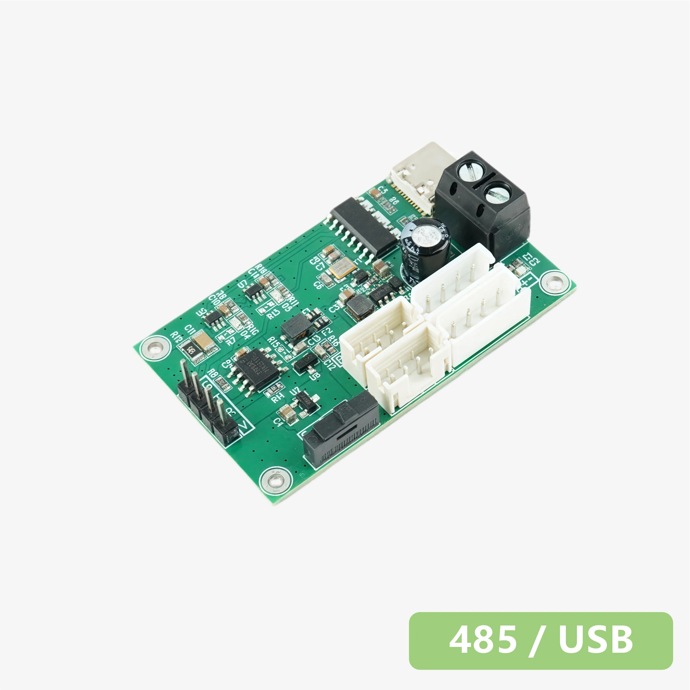
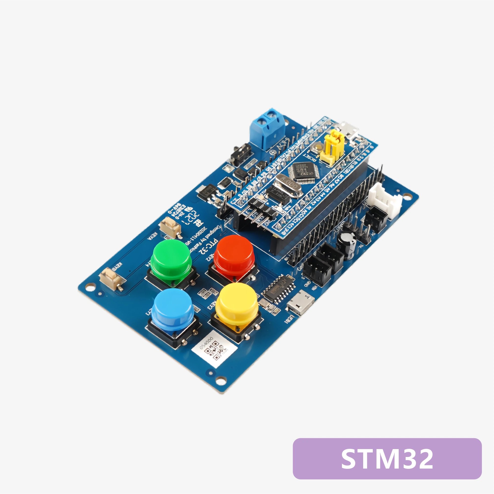
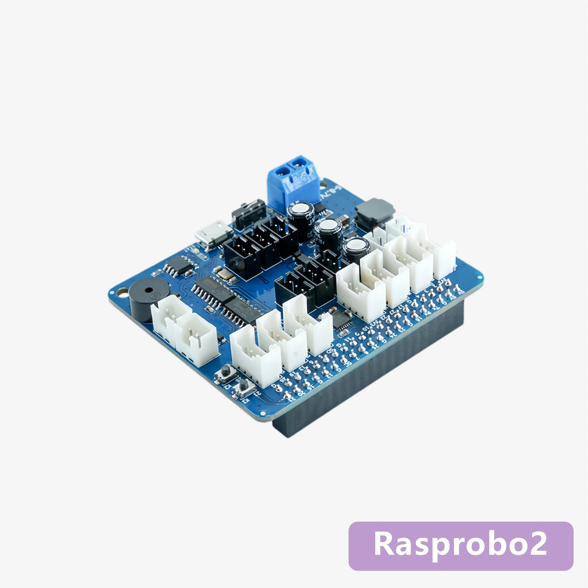
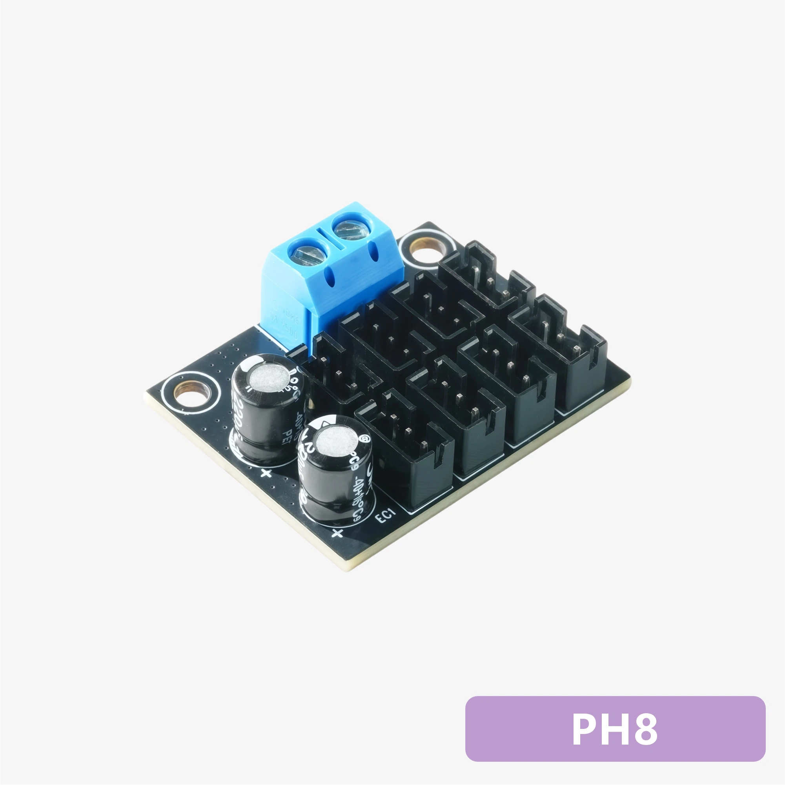

# 周边配件 - 产品规格书
---

## 转接调试板

  <a class="parts-ds-card" href="./datasheet-uc-01">
    
    TTL/USB 转接调试板 UC-01
  </a>
  <a class="parts-ds-card" href="./datasheet-uc-02">
    
    TTL/RS232 转接调试板 UC-02
  </a>
  <a class="parts-ds-card" href="./datasheet-uc-04">
    
    RS485 转接调试板 UC-04
  </a>
  <a class="parts-ds-card" href="./datasheet-uc-05">
    
    RS485/USB 转接调试板 UC-05
  </a>

---

## 多合一主控板

  <a class="parts-ds-card" href="./datasheet-ptc-32">
    
    STM32 多合一主控板开发板 PTC-32
  </a>

---

## 拓展板

  <a class="parts-ds-card" href="./datasheet-rasprobo2">
    
    树莓派总线舵机扩展板 Rasprobo2
  </a>
  <a class="parts-ds-card" href="./datasheet-ph8">
    
    UART串行总线舵机分线板 PH8
  </a>

