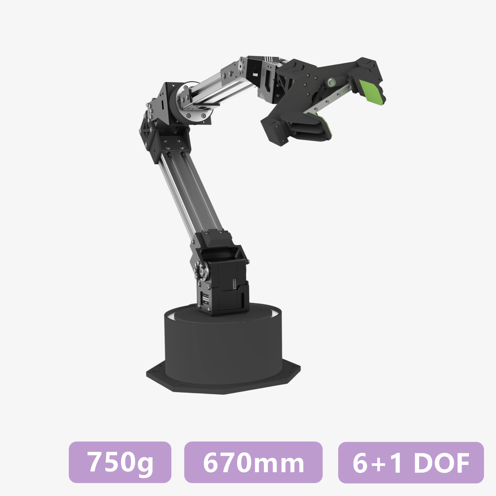
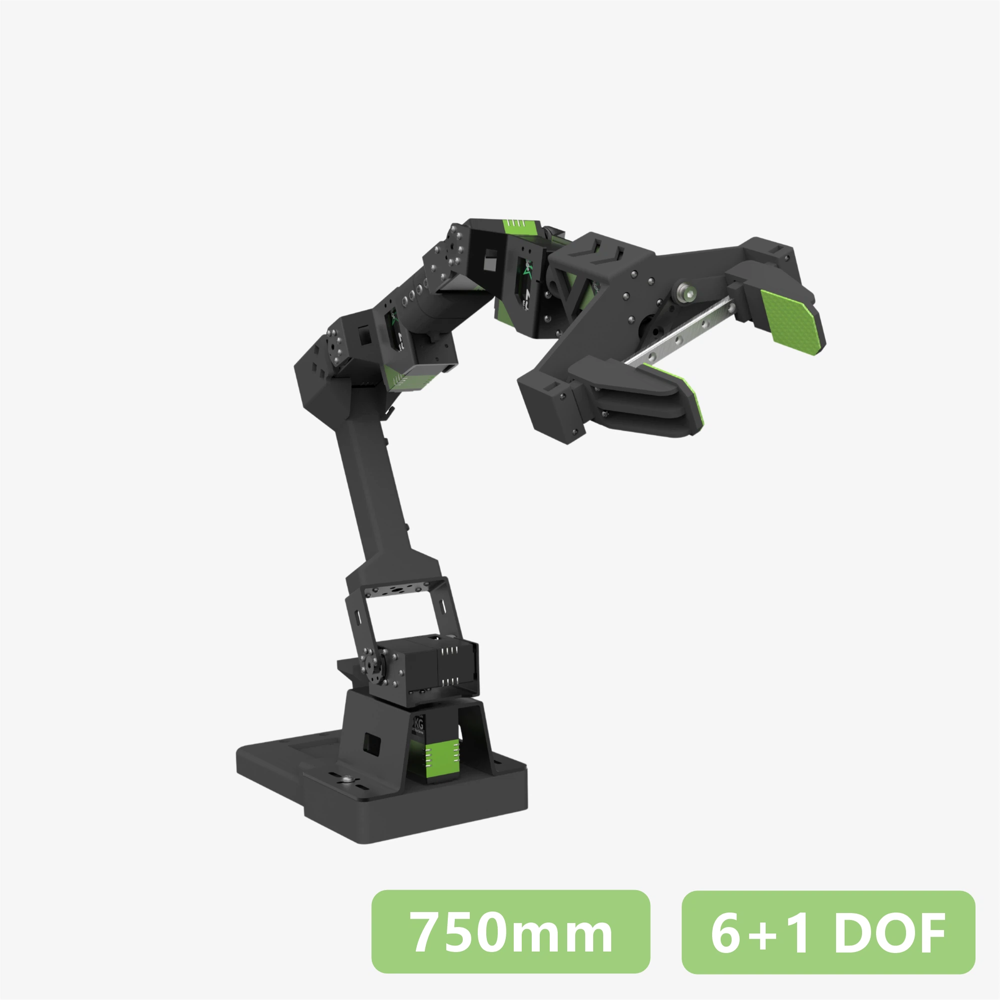
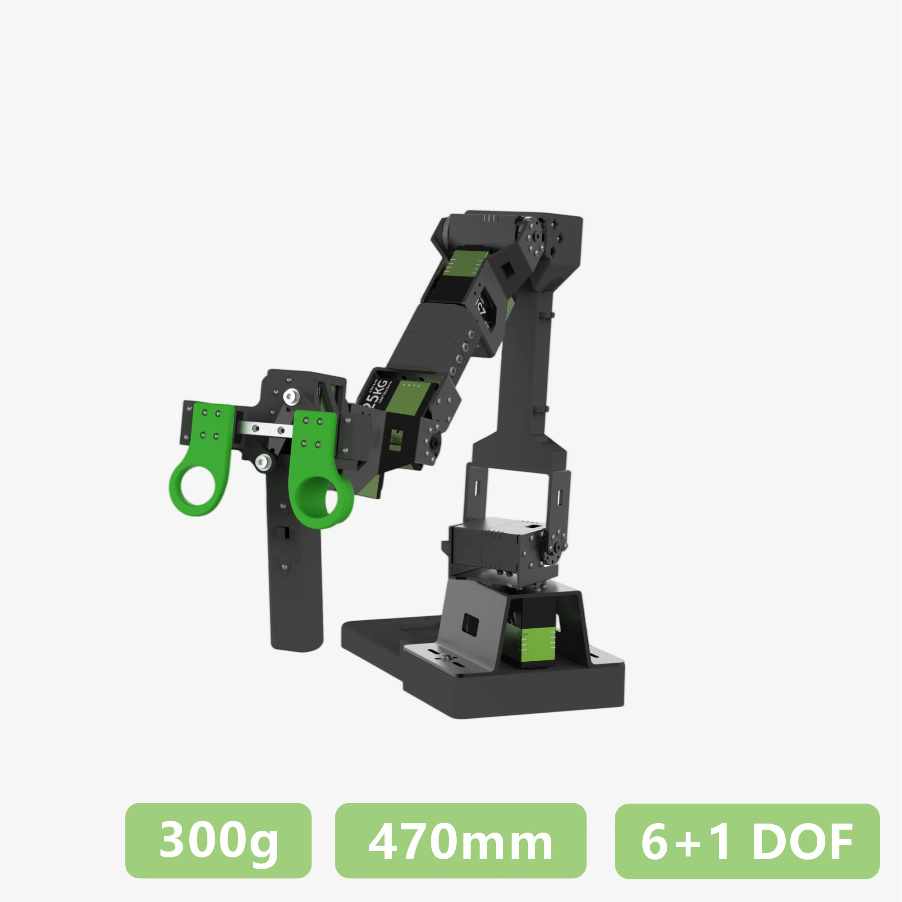

# StarAI Arm - CAD 图纸与周边模型下载

---

> [!TIP]
> - 建议使用 SolidWorks 2021 及以上版本打开模型。
> - 图中尺寸仅供参考，请以实物为准；如差异较大，请联系我们确认。

## StarAI Arm 系列

<table class="cad-files-table" cellpadding="0" cellspacing="0">
  <tr>
    <th width="110" align="center">外观</th>
    <th width="140" align="center">型号</th>
    <th align="center">下载</th>
  </tr>
  <tr>
    <td align="center">
      

    </td>
    <td align="center"><strong><a href="../datasheet/cello/">Cello（遥操臂）</a></strong></td>
    <td align="center">
      <a href="./data/cello-dimension.pdf" download>PDF</a> ｜ <a href="./data/cello-dimension.dwg" download>DWG</a>
      
        <a href="./data/cello-dimension.pdf" download>PDF</a>
        <a href="./data/cello-dimension.dwg" download>DWG</a>
      
    </td>
  </tr>
  <tr>
    <td align="center">
      

    </td>
    <td align="center"><strong><a href="../datasheet/viola/">Viola（遥操臂）</a></strong></td>
    <td align="center">
      <a href="./data/viola-dimension.pdf" download>PDF</a> ｜ <a href="./data/viola-dimension.dwg" download>DWG</a>
      
        <a href="./data/viola-dimension.pdf" download>PDF</a>
        <a href="./data/viola-dimension.dwg" download>DWG</a>
      
    </td>
  </tr>
  <tr>
    <td align="center">
      

    </td>
    <td align="center"><strong><a href="../datasheet/violin/">Violin（跟随臂）</a></strong></td>
    <td align="center">
      <a href="./data/violin-dimension.pdf" download>PDF</a> ｜ <a href="./data/violin-dimension.dwg" download>DWG</a>
      
        <a href="./data/violin-dimension.pdf" download>PDF</a>
        <a href="./data/violin-dimension.dwg" download>DWG</a>
      
    </td>
  </tr>
</table>

## 周边配件

- **[平行夹爪](../quick-start/cello-violin.md)**

    适用于机械臂末端抓取任务，支持常见物体的稳定夹持与抓取验证。

- **[L 型宽幅指尖替换件](../quick-start/cello-violin.md)**

    用于扩展夹爪接触面积，适配大尺寸或异形目标的抓取场景。

## URDF模型

- **[Cello](../quick-start/ros2.md)**

    提供 Cello（遥操臂）的 URDF 模型与 ROS2/MoveIt2 集成参考。

- **[Viola](../quick-start/ros2.md)**

    提供 Viola（遥操臂）的 URDF 模型与 ROS2/MoveIt2 集成参考。
