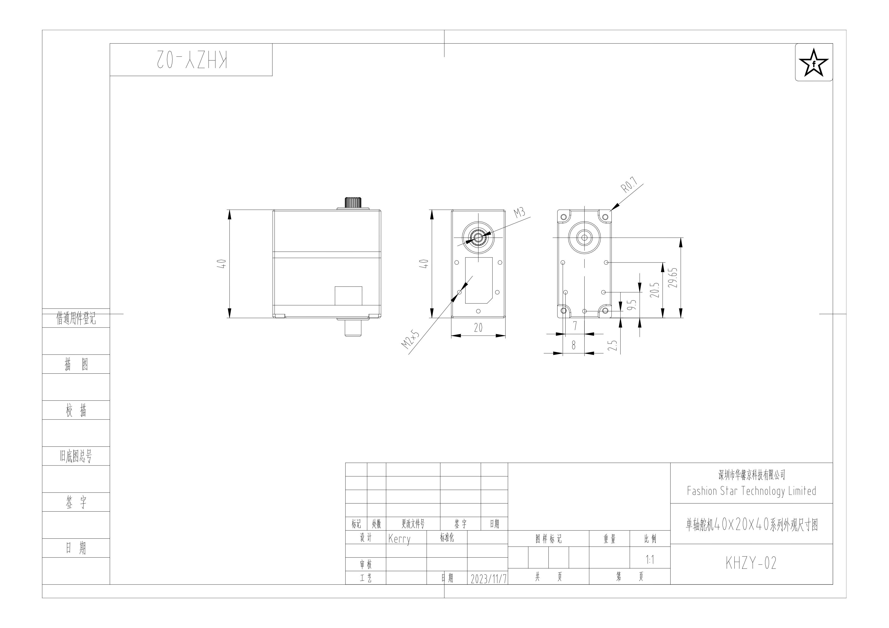
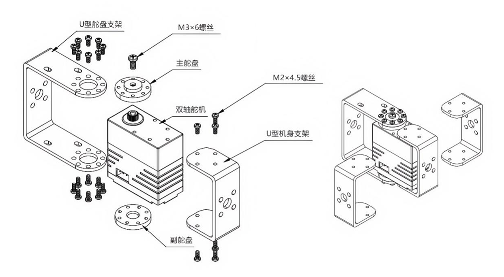

# 产品规格书 - RA8-P25

<!-- 分割线+PDF文件下载图标，用宏调用（路径/鼠标悬浮显示名称/48px不要动） -->
{{ pdf_line("../pdf/Fashion-Star-RA8-P25.pdf", "下载规格书", "48px") }}

<!-- 产品主图，中文taobao/英文simple-->


<!-- ##1.产品特点 -->


<!-- ##2.型号定义 -->


## 3. 规格参数
### 3.1 基础参数
<table>
  <tr><th width="200" align="left">参数项</th><th width="400" align="left">参数值</th></tr>
  <tr><td>工作电压</td><td>6.0 ~ 8.4 V</td></tr>
  <tr><td>马达类型</td><td>铁芯</td></tr>
  <tr><td>位置传感器</td><td>电位器</td></tr>
  <tr><td>有效角度</td><td>180° (@500→2500μsec)</td></tr>
  <tr><td>旋转方向</td><td>逆时针(500→2500μsec)</td></tr>
  <tr><td>控制信号</td><td>PWM</td></tr>
  <tr><td>PWM 周期范围</td><td>3 ~ 40 ms</td></tr>
  <tr><td>死区</td><td>2 μs</td></tr>
  <tr><td>齿比</td><td>273:1</td></tr>
  <tr><td>输出齿规格</td><td>铜 / 25T</td></tr>
  <tr><td>输出齿支撑</td><td>双轴承</td></tr>
  <tr><td>接口类型</td><td>PH2.0 x 2</td></tr>
  <tr><td>外壳材料</td><td>铝合金中段 / 上下壳工程塑胶</td></tr>
  <tr><td>尺寸</td><td>40 x 40 x 20 mm</td></tr>
  <tr><td>重量</td><td>60 g</td></tr>
</table>

### 3.2 特性参数
<table>
  <tr><th width="200" align="left">参数项</th><th width="400" align="left">参数值</th></tr>
  <tr><td>堵转扭矩</td><td>@8.4V: 30 kg-cm @7.4V: 25 kg-cm @6.0V: 20 kg-cm</td></tr>
  <tr><td>空载速度</td><td>@8.4V: 0.139 sec / 60° @7.4V: 0.150 sec / 60° @6.0V: 0.171 sec / 60°</td></tr>
  <tr><td>堵转电流</td><td>3 A</td></tr>
  <tr><td>空载电流</td><td>300 mA</td></tr>
  <tr><td>待机电流</td><td>50 mA</td></tr>
</table>

## 4. 外观尺寸与安装

**文件下载：**
[PDF](../cad-files/data/ra8-rp8-rx8-series-dimension.pdf){ ra8-rp8-rx8-series-dimension.pdf } ～
[STEP](../cad-files/data/ra8-rp8-rx8-series-3D.STEP.zip){ ra8-rp8-rx8-series-3D.STEP.zip } ～
[DWG](../cad-files/data/ra8-rp8-rx8-series-dimension.dwg.zip){ ra8-rp8-rx8-series-dimension.dwg.zip }～
[更多配件图纸](../../parts/index.md)

<!-- ##5.接口与连线-->

