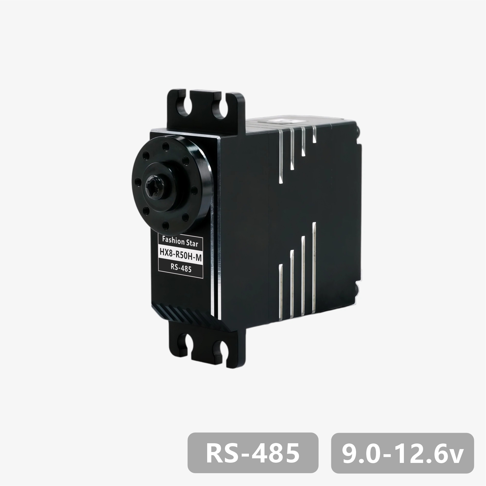
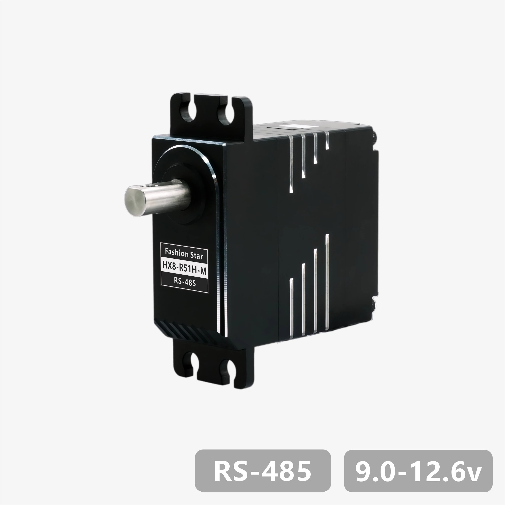
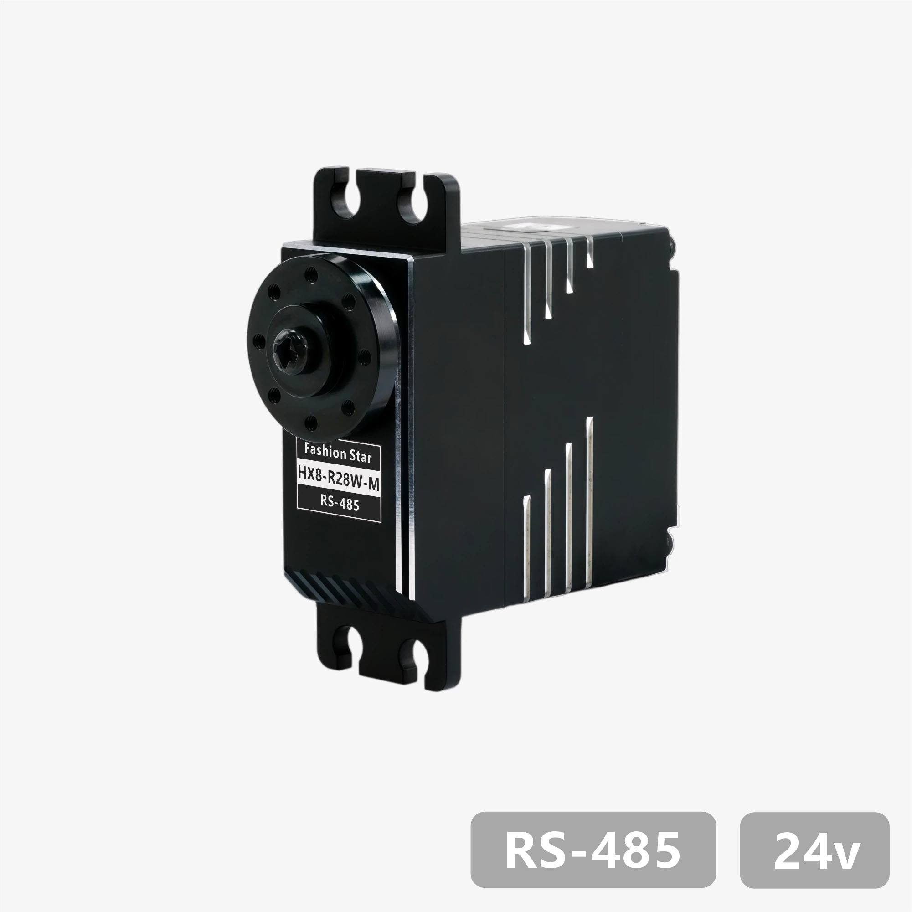
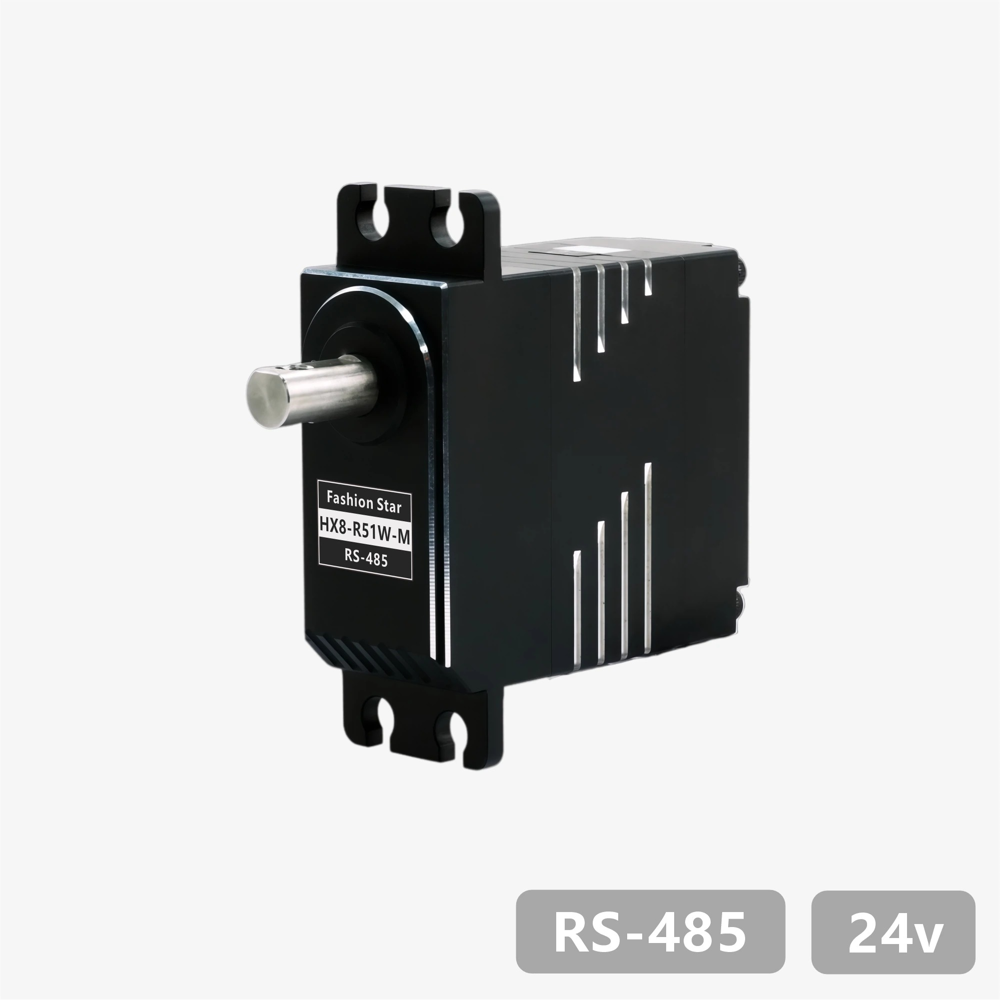
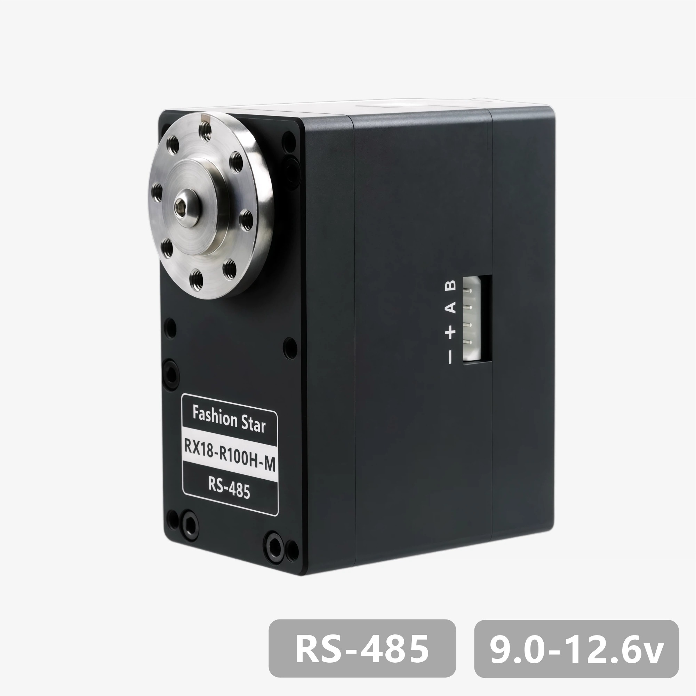
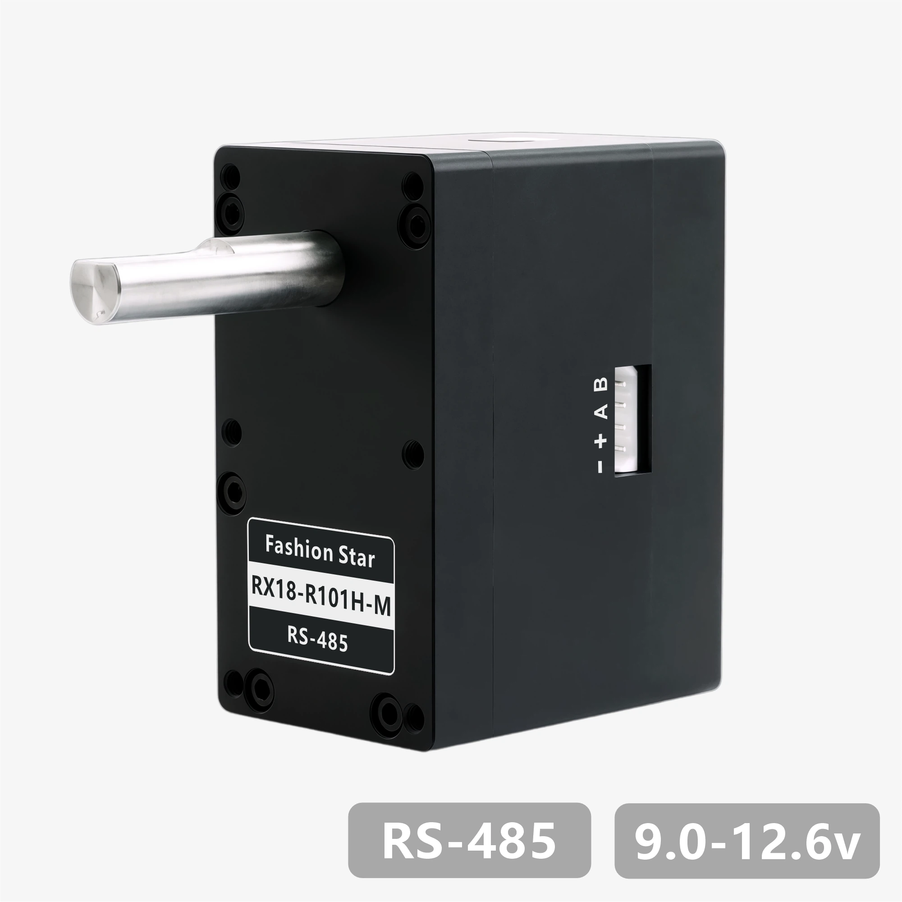
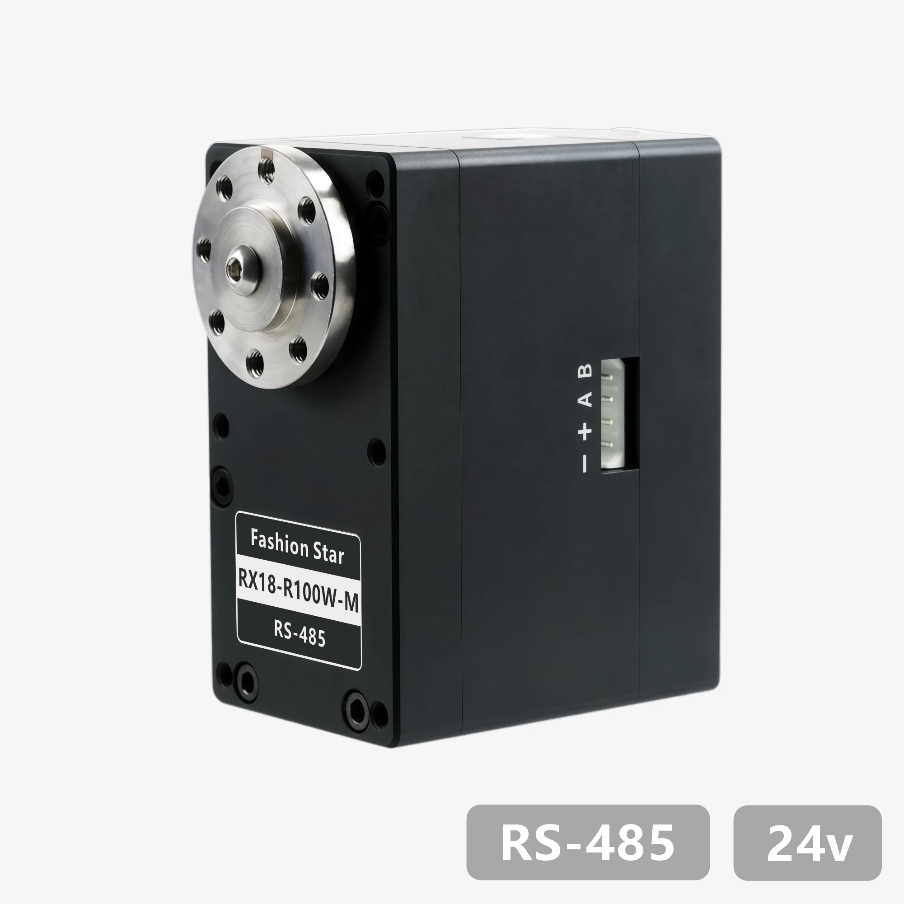
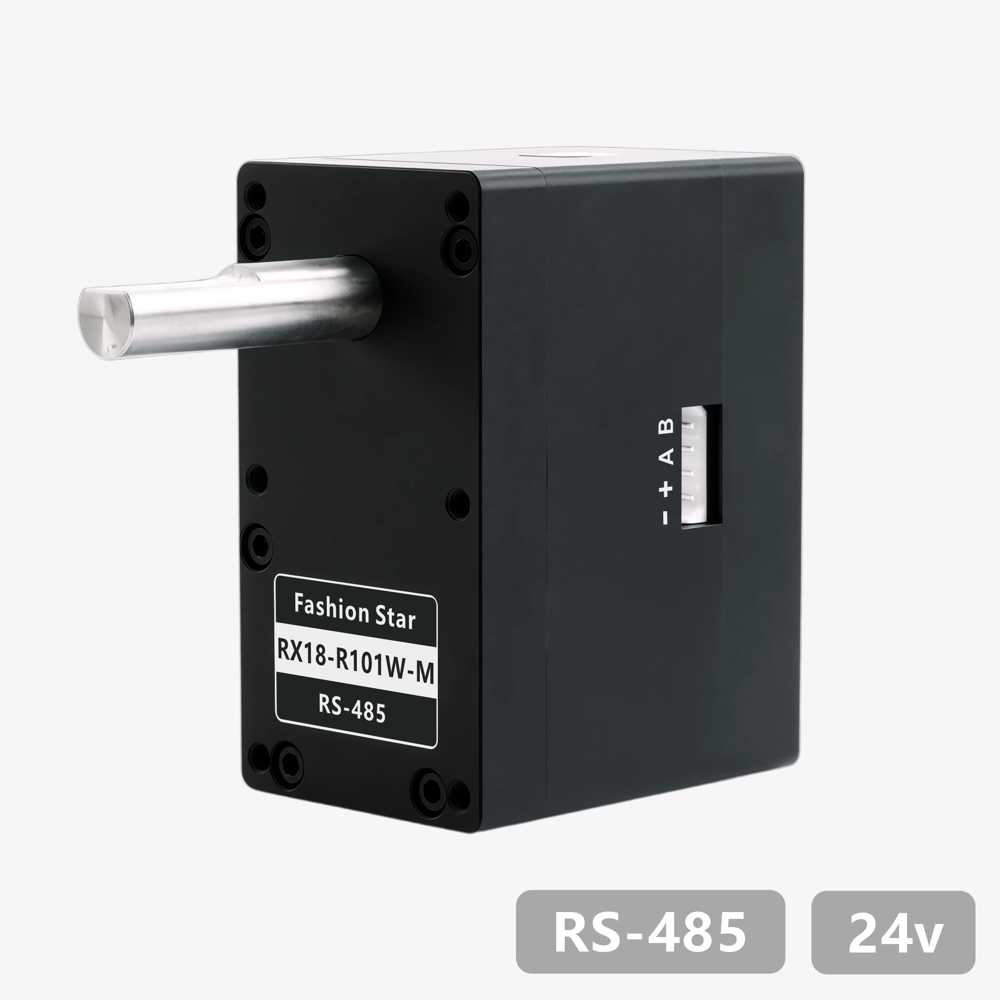

# RS485 总线舵机 - CAD 图纸与 3D 模型下载
---

其他协议舵机的图纸与模型资料：[UART 总线舵机](../../uart/cad-files/) ｜ [CAN Bus 总线舵机](../../canbus/cad-files/) ｜ [PWM 数字舵机](../../pwm/cad-files/)

> [!TIP]
> - 建议使用 SolidWorks 2021 及以上版本打开模型。
> - 图中尺寸仅供参考，请以实物为准；如差异较大，请联系我们确认。

## 40×40×20(mm) 全金属外壳

<table class="cad-files-table" cellpadding="0" cellspacing="0">
  <tr>
    <th width="110" align="center">外观</th>
    <th width="140" align="center">型号</th>
    <th align="center">下载</th>
  </tr>
  <tr>
    <td align="center" style="padding: 0; line-height: 0; font-size: 0;"></td>
    <td align="center"><strong><a href="../datasheet/hx8-r28h-m/">HX8-R28H-M</a></strong></td>
    <td align="center"><a href="./data/hx8-series-dimension.pdf" download>PDF</a> ｜ <a href="./data/hx8-series-3D.STEP.zip" download>STEP</a> ｜ <a href="./data/hx8-series-dimension.dwg.zip" download>DWG</a><a href="./data/hx8-series-dimension.pdf" download>PDF</a><a href="./data/hx8-series-3D.STEP.zip" download>STEP</a><a href="./data/hx8-series-dimension.dwg.zip" download>DWG</a></td>
  </tr>
  <tr>
    <td align="center" style="padding: 0; line-height: 0; font-size: 0;"></td>
    <td align="center"><strong><a href="../datasheet/hx8-r29h-m/">HX8-R29H-M</a></strong></td>
    <td align="center"><a href="./data/hx8-dshaft-series-dimension.pdf" download>PDF</a> ｜ <a href="./data/hx8-dshaft-series-3D.STEP.zip" download>STEP</a> ｜ <a href="./data/hx8-dshaft-series-dimension.dwg.zip" download>DWG</a><a href="./data/hx8-dshaft-series-dimension.pdf" download>PDF</a><a href="./data/hx8-dshaft-series-3D.STEP.zip" download>STEP</a><a href="./data/hx8-dshaft-series-dimension.dwg.zip" download>DWG</a></td>
  </tr>
  <tr>
    <td align="center" style="padding: 0; line-height: 0; font-size: 0;"></td>
    <td align="center"><strong><a href="../datasheet/hx8-r50h-m/">HX8-R50H-M</a></strong></td>
    <td align="center"><a href="./data/hx8-series-dimension.pdf" download>PDF</a> ｜ <a href="./data/hx8-series-3D.STEP.zip" download>STEP</a> ｜ <a href="./data/hx8-series-dimension.dwg.zip" download>DWG</a><a href="./data/hx8-series-dimension.pdf" download>PDF</a><a href="./data/hx8-series-3D.STEP.zip" download>STEP</a><a href="./data/hx8-series-dimension.dwg.zip" download>DWG</a></td>
  </tr>
  <tr>
    <td align="center" style="padding: 0; line-height: 0; font-size: 0;"></td>
    <td align="center"><strong><a href="../datasheet/hx8-r51h-m/">HX8-R51H-M</a></strong></td>
    <td align="center"><a href="./data/hx8-dshaft-series-dimension.pdf" download>PDF</a> ｜ <a href="./data/hx8-dshaft-series-3D.STEP.zip" download>STEP</a> ｜ <a href="./data/hx8-dshaft-series-dimension.dwg.zip" download>DWG</a><a href="./data/hx8-dshaft-series-dimension.pdf" download>PDF</a><a href="./data/hx8-dshaft-series-3D.STEP.zip" download>STEP</a><a href="./data/hx8-dshaft-series-dimension.dwg.zip" download>DWG</a></td>
  </tr>
  <tr>
    <td align="center" style="padding: 0; line-height: 0; font-size: 0;"></td>
    <td align="center"><strong><a href="../datasheet/hx8-r28w-m/">HX8-R28W-M</a></strong></td>
    <td align="center"><a href="./data/hx8-series-dimension.pdf" download>PDF</a> ｜ <a href="./data/hx8-series-3D.STEP.zip" download>STEP</a> ｜ <a href="./data/hx8-series-dimension.dwg.zip" download>DWG</a><a href="./data/hx8-series-dimension.pdf" download>PDF</a><a href="./data/hx8-series-3D.STEP.zip" download>STEP</a><a href="./data/hx8-series-dimension.dwg.zip" download>DWG</a></td>
  </tr>
  <tr>
    <td align="center" style="padding: 0; line-height: 0; font-size: 0;"></td>
    <td align="center"><strong><a href="../datasheet/hx8-r29w-m/">HX8-R29W-M</a></strong></td>
    <td align="center"><a href="./data/hx8-dshaft-series-dimension.pdf" download>PDF</a> ｜ <a href="./data/hx8-dshaft-series-3D.STEP.zip" download>STEP</a> ｜ <a href="./data/hx8-dshaft-series-dimension.dwg.zip" download>DWG</a><a href="./data/hx8-dshaft-series-dimension.pdf" download>PDF</a><a href="./data/hx8-dshaft-series-3D.STEP.zip" download>STEP</a><a href="./data/hx8-dshaft-series-dimension.dwg.zip" download>DWG</a></td>
  </tr>
  <tr>
    <td align="center" style="padding: 0; line-height: 0; font-size: 0;"></td>
    <td align="center"><strong><a href="../datasheet/hx8-r50w-m/">HX8-R50W-M</a></strong></td>
    <td align="center"><a href="./data/hx8-series-dimension.pdf" download>PDF</a> ｜ <a href="./data/hx8-series-3D.STEP.zip" download>STEP</a> ｜ <a href="./data/hx8-series-dimension.dwg.zip" download>DWG</a><a href="./data/hx8-series-dimension.pdf" download>PDF</a><a href="./data/hx8-series-3D.STEP.zip" download>STEP</a><a href="./data/hx8-series-dimension.dwg.zip" download>DWG</a></td>
  </tr>
  <tr>
    <td align="center" style="padding: 0; line-height: 0; font-size: 0;"></td>
    <td align="center"><strong><a href="../datasheet/hx8-r51w-m/">HX8-R51W-M</a></strong></td>
    <td align="center"><a href="./data/hx8-dshaft-series-dimension.pdf" download>PDF</a> ｜ <a href="./data/hx8-dshaft-series-3D.STEP.zip" download>STEP</a> ｜ <a href="./data/hx8-dshaft-series-dimension.dwg.zip" download>DWG</a><a href="./data/hx8-dshaft-series-dimension.pdf" download>PDF</a><a href="./data/hx8-dshaft-series-3D.STEP.zip" download>STEP</a><a href="./data/hx8-dshaft-series-dimension.dwg.zip" download>DWG</a></td>
  </tr>
</table>

## 63×34×47(mm) 全金属外壳

<table class="cad-files-table" cellpadding="0" cellspacing="0">
  <tr>
    <th width="110" align="center">外观</th>
    <th width="140" align="center">型号</th>
    <th align="center">下载</th>
  </tr>
  <tr>
    <td align="center" style="padding: 0; line-height: 0; font-size: 0;"></td>
    <td align="center"><strong><a href="../datasheet/rx18-r100h-m/">RX18-R100H-M</a></strong></td>
    <td align="center"><a href="./data/rx18-r100h-m-dimension.pdf" download>PDF</a> ｜ <a href="./data/rx18-r100h-m-3D.STEP.zip" download>STEP</a> ｜ <a href="./data/rx18-r100h-m-dimension.dwg.zip" download>DWG</a><a href="./data/rx18-r100h-m-dimension.pdf" download>PDF</a><a href="./data/rx18-r100h-m-3D.STEP.zip" download>STEP</a><a href="./data/rx18-r100h-m-dimension.dwg.zip" download>DWG</a></td>
  </tr>
  <tr>
    <td align="center" style="padding: 0; line-height: 0; font-size: 0;"></td>
    <td align="center"><strong><a href="../datasheet/rx18-r101h-m/">RX18-R101H-M</a></strong></td>
    <td align="center"><a href="./data/rx18-r101h-m-dimension.pdf" download>PDF</a> ｜ <a href="./data/rx18-r101h-m-3D.STEP.zip" download>STEP</a> ｜ <a href="./data/rx18-r101h-m-dimension.dwg.zip" download>DWG</a><a href="./data/rx18-r101h-m-dimension.pdf" download>PDF</a><a href="./data/rx18-r101h-m-3D.STEP.zip" download>STEP</a><a href="./data/rx18-r101h-m-dimension.dwg.zip" download>DWG</a></td>
  </tr>
  <tr>
    <td align="center" style="padding: 0; line-height: 0; font-size: 0;"></td>
    <td align="center"><strong><a href="../datasheet/rx18-r100w-m/">RX18-R100W-M</a></strong></td>
    <td align="center"><a href="./data/rx18-r100h-m-dimension.pdf" download>PDF</a> ｜ <a href="./data/rx18-r100h-m-3D.STEP.zip" download>STEP</a> ｜ <a href="./data/rx18-r100h-m-dimension.dwg.zip" download>DWG</a><a href="./data/rx18-r100h-m-dimension.pdf" download>PDF</a><a href="./data/rx18-r100h-m-3D.STEP.zip" download>STEP</a><a href="./data/rx18-r100h-m-dimension.dwg.zip" download>DWG</a></td>
  </tr>
  <tr>
    <td align="center" style="padding: 0; line-height: 0; font-size: 0;"></td>
    <td align="center"><strong><a href="../datasheet/rx18-r101w-m/">RX18-R101W-M</a></strong></td>
    <td align="center"><a href="./data/rx18-r101h-m-dimension.pdf" download>PDF</a> ｜ <a href="./data/rx18-r101h-m-3D.STEP.zip" download>STEP</a> ｜ <a href="./data/rx18-r101h-m-dimension.dwg.zip" download>DWG</a><a href="./data/rx18-r101h-m-dimension.pdf" download>PDF</a><a href="./data/rx18-r101h-m-3D.STEP.zip" download>STEP</a><a href="./data/rx18-r101h-m-dimension.dwg.zip" download>DWG</a></td>
  </tr>
</table>
