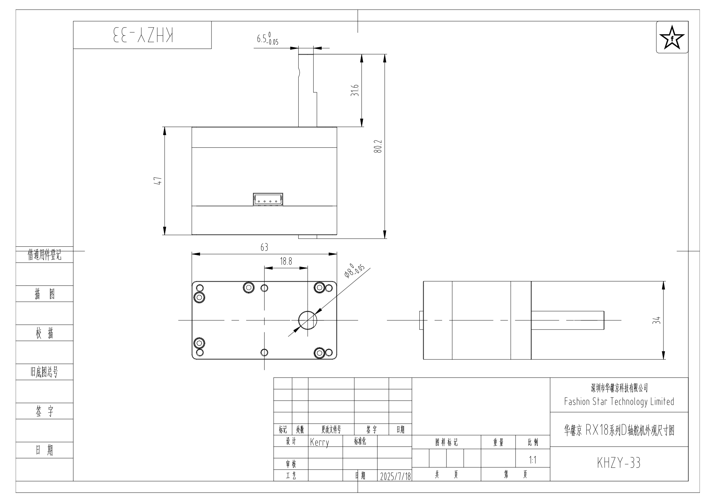
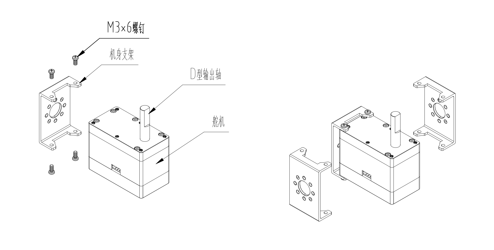

# 产品规格书 - RX18-R101H-M

<!-- 分割线+PDF文件下载图标，用宏调用（路径/鼠标悬浮显示名称/48px不要动） -->
{{ pdf_line("../pdf/Fashion-Star-RX18-R101H-M.pdf", "下载规格书", "48px") }}

<!-- 产品主图，中文taobao/英文simple -->


<!-- ##1.产品特点，不同马达类型引用不同段落 -->


<!-- ##2.型号定义 -->


<!-- ##3.规格参数（全部手工填写） -->
## 3. 规格参数
### 3.1 基础参数
<table>
  <tr>
    <th width="200" align="left">参数项</th>
    <th width="400" align="left">参数值</th>
  </tr>
  <tr>
    <td>工作电压</td>
    <td>9.0～12.6 V</td>
  </tr>

  <tr>
    <td>马达类型</td>
    <td>无刷马达</td>
  </tr>
  <tr>
    <td>位置传感器</td>
    <td>12-bit 非接触式绝对值编码器（磁编码）</td>
  </tr>
  <tr>
    <td>分辨率</td>
    <td>4096 阶 / 360°（0.088°）</td>
  </tr>
  <tr>
    <td>有效角度(行程范围)</td>
    <td>±180°（单圈角度）| ±368,640°（多圈角度）</td>
  </tr>
  <tr>
    <td>处理器</td>
    <td>32-bit MCU</td>
  </tr>
  <tr>
    <td>通信类型</td>
    <td>RS-485</td>
  </tr>
  <tr>
    <td>波特率</td>
    <td>9,600 bps ～ 1 Mbps</td>
  </tr>
  <tr>
    <td>ID 范围</td>
    <td>0 ～ 254</td>
  </tr>
  <tr>
    <td>减速比</td>
    <td>392:1</td>
  </tr>
  <tr>
    <td>输出齿规格</td>
    <td>不锈钢 / 15T</td>
  </tr>
  <tr>
    <td>齿轮材料</td>
    <td>全金属不锈钢组合</td>
  </tr>
  <tr>
    <td>外壳材料</td>
    <td>全铝合金</td>
  </tr>
  <tr>
    <td>接口类型</td>
    <td>5264-4Pin</td>
  </tr>
  <tr>
    <td>尺寸重量</td>
    <td>63 × 34 × 47 mm / 242 g</td>
  </tr>
  <tr>
    <td>工作温度</td>
    <td>-10～60 ℃</td>
  </tr>
  <tr>
    <td>工作模式</td>
    <td>单圈角度 | 多圈角度 | 阻尼模式</td>
  </tr>
</table>

### 3.2 特性参数（@12V）
<table>
  <tr>
    <th width="200" align="left">参数项</th>
    <th width="400" align="left">参数值</th>
  </tr>
  <tr>
    <td>最大静态扭矩（堵转）</td>
    <td>9.80 N·m（100kg·cm）</td>
  </tr>
  <tr>
    <td>最大动态扭矩</td>
    <td>4.90 N·m（50kg·cm）</td>
  </tr>
  <tr>
    <td>额定扭矩</td>
    <td>3.14 N·m（32kg·cm）</td>
  </tr>
  <tr>
    <td>额定转速</td>
    <td>35 rpm（0.286 sec @ 60°）</td>
  </tr>
  <tr>
    <td>空载转速</td>
    <td>42 rpm（0.238 sec @ 60°）</td>
  </tr>
  <tr>
    <td>空载电流</td>
    <td>＜300 mA</td>
  </tr>
  <tr>
    <td>待机电流</td>
    <td>＜50 mA</td>
  </tr>
  <tr>
    <td>峰值电流</td>
    <td>13 A</td>
  </tr>
  <tr>
    <td>轴向负载</td>
    <td>20 N</td>
  </tr>
   <tr>
    <td>径向负载</td>
    <td>40 N</td>
  </tr>
</table>
<!-- 两张特性曲线图，用宏加载（路径/标题/大小500px不要动）-->
{{ fig_center("../images/R101H-torque-speed-curve.webp", "T-N 特性曲线", "500px") }}

{{ fig_center("../images/R101H-mechanical-overload-curve.webp", "机械过载曲线", "500px") }}

## 4. 外观尺寸与安装

**文件下载：**
[PDF](../cad-files/data/rx18-r101h-m-dimension.pdf){ rx18-r101h-m-dimension.pdf } ｜ 
[STEP](../cad-files/data/rx18-r101h-m-3D.STEP.zip){ rx18-r101h-m-3D.STEP.zip } ｜ 
[DWG](../cad-files/data/rx18-r101h-m-dimension.dwg.zip){ rx18-r101h-m-dimension.dwg.zip }｜ 
[更多配件图纸](../../parts/index.md)

<!-- ##5.接口与连线 -->


<!-- ##6.开发环境与SDK -->


<!-- ##7-10.开发环境与SDK/保护功能/指令与协议/运动控制/参数设置与升级 -->

