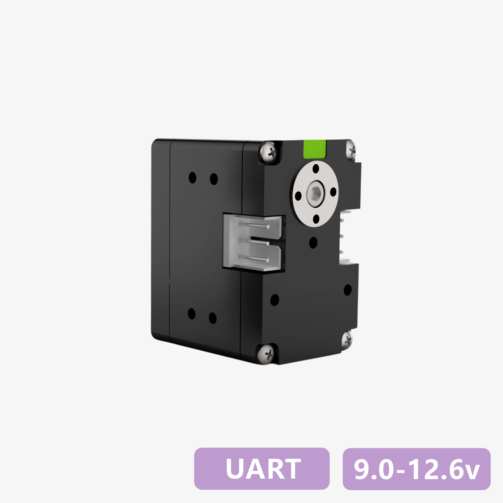
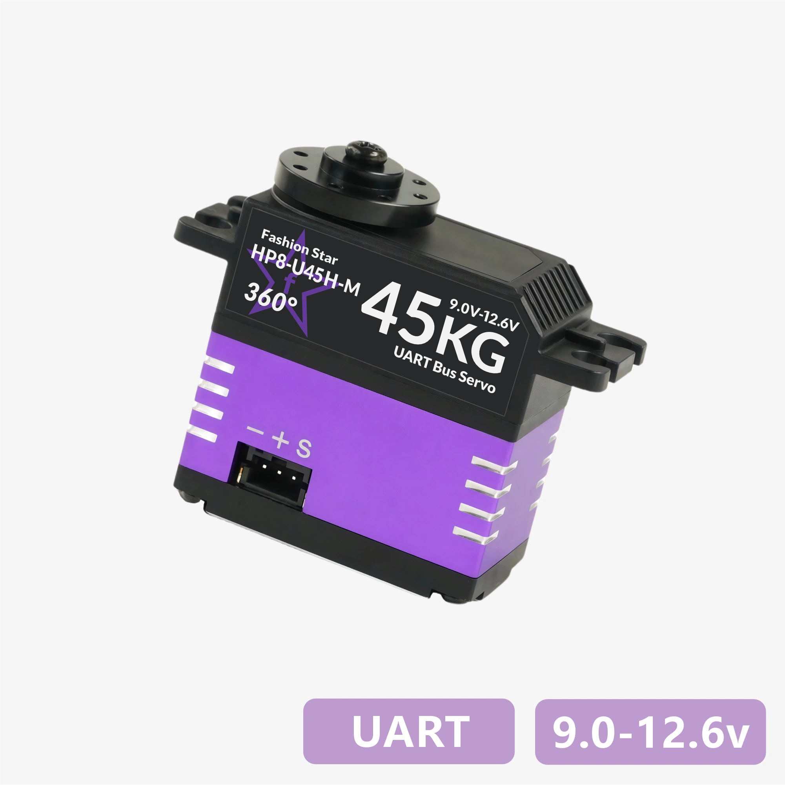
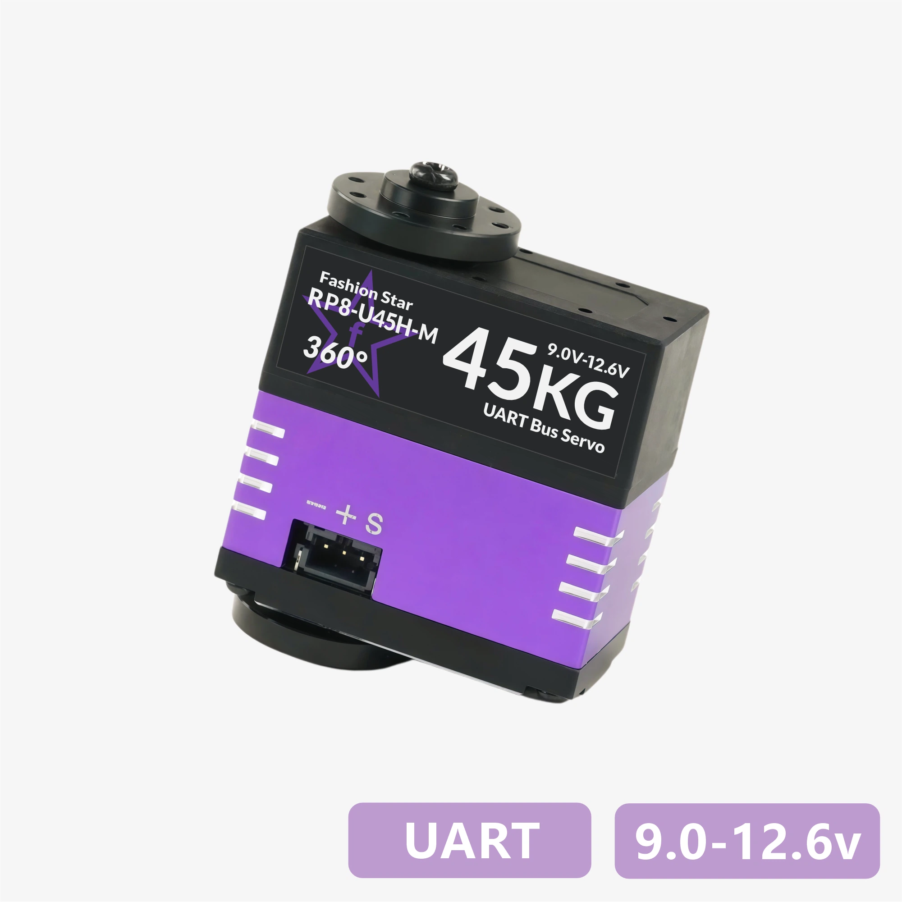

# UART 总线伺服舵机 - CAD 图纸与 3D 模型下载
---

其他协议舵机的图纸与模型资料：[RS485 总线舵机](../../rs485/cad-files/) ｜ [CAN Bus 总线舵机](../../canbus/cad-files/) ｜ [PWM 数字舵机](../../pwm/cad-files/)

> [!TIP]
> - 建议使用 SolidWorks 2021 及以上版本打开模型。
> - 图中尺寸仅供参考，请以实物为准；如差异较大，请联系我们确认。

## 紧凑型系列

<table class="cad-files-table" cellpadding="0" cellspacing="0">
  <tr>
    <th width="110" align="center">外观</th>
    <th width="140" align="center">型号</th>
    <th align="center">下载</th>
  </tr>
  <tr>
    <td align="center" style="padding: 0; line-height: 0; font-size: 0;"></td>
    <td align="center"><strong><a href="../datasheet/rx6-u12h-m/">RX6-U12H-M</a></strong></td>
    <td align="center"><a href="./data/rx6-u12h-m-dimension.pdf" download>PDF</a> ｜ <a href="./data/rx6-u12h-m-3D.STEP.zip" download>STEP</a> ｜ <a href="./data/rx6-u12h-m-dimension.DWG.zip" download>DWG</a><a href="./data/rx6-u12h-m-dimension.pdf" download>PDF</a><a href="./data/rx6-u12h-m-3D.STEP.zip" download>STEP</a><a href="./data/rx6-u12h-m-dimension.DWG.zip" download>DWG</a></td>
  </tr>
  <tr>
    <td align="center" style="padding: 0; line-height: 0; font-size: 0;"></td>
    <td align="center"><strong><a href="../datasheet/hp6-u15h-m/">HP6-U15H-M</a></strong></td>
    <td align="center"><a href="./data/hp6-u15h-m-dimension.pdf" download>PDF</a> ｜ <a href="./data/hp6-u15h-m-3D.STEP.zip" download>STEP</a> ｜ <a href="./data/hp6-u15h-m-dimension.dwg.zip" download>DWG</a><a href="./data/hp6-u15h-m-dimension.pdf" download>PDF</a><a href="./data/hp6-u15h-m-3D.STEP.zip" download>STEP</a><a href="./data/hp6-u15h-m-dimension.dwg.zip" download>DWG</a></td>
  </tr>
  <tr>
    <td align="center" style="padding: 0; line-height: 0; font-size: 0;"></td>
    <td align="center"><strong><a href="../datasheet/rp6-u15h-m/">RP6-U15H-M</a></strong></td>
    <td align="center"><a href="./data/rp6-u15h-m-dimension.pdf" download>PDF</a> ｜ <a href="./data/rp6-u15h-m-3D.STEP.zip" download>STEP</a> ｜ <a href="./data/rp6-u15h-m-dimension.dwg.zip" download>DWG</a><a href="./data/rp6-u15h-m-dimension.pdf" download>PDF</a><a href="./data/rp6-u15h-m-3D.STEP.zip" download>STEP</a><a href="./data/rp6-u15h-m-dimension.dwg.zip" download>DWG</a></td>
  </tr>
  <tr>
    <td align="center" style="padding: 0; line-height: 0; font-size: 0;"></td>
    <td align="center"><strong><a href="../datasheet/rp6-u18h-m/">RP6-U18H-M</a></strong></td>
    <td align="center"><a href="./data/rp6-u18h-m-dimension.pdf" download>PDF</a> ｜ <a href="./data/rp6-u18h-m-3D.STEP.zip" download>STEP</a> ｜ <a href="./data/rp6-u18h-m-dimension.DWG.zip" download>DWG</a><a href="./data/rp6-u18h-m-dimension.pdf" download>PDF</a><a href="./data/rp6-u18h-m-3D.STEP.zip" download>STEP</a><a href="./data/rp6-u18h-m-dimension.DWG.zip" download>DWG</a></td>
  </tr>
</table>

## 40×40×20(mm) 标准系列

<table class="cad-files-table" cellpadding="0" cellspacing="0">
  <tr>
    <th width="110" align="center">外观</th>
    <th width="140" align="center">型号</th>
    <th align="center">下载</th>
  </tr>
  <tr>
    <td align="center" style="padding: 0; line-height: 0; font-size: 0;"></td>
    <td align="center"><strong><a href="../datasheet/ha8-u25-m/">HA8-U25-M</a></strong> <strong><a href="../datasheet/ha8-u25h-m/">HA8-U25H-M</a></strong></td>
    <td align="center"><a href="./data/ha8-hp8-hx8-series-dimension.pdf" download>PDF</a> ｜ <a href="./data/ha8-hp8-hx8-series-3D.STEP.zip" download>STEP</a> ｜ <a href="./data/ha8-hp8-hx8-series-dimension.dwg.zip" download>DWG</a><a href="./data/ha8-hp8-hx8-series-dimension.pdf" download>PDF</a><a href="./data/ha8-hp8-hx8-series-3D.STEP.zip" download>STEP</a><a href="./data/ha8-hp8-hx8-series-dimension.dwg.zip" download>DWG</a></td>
  </tr>
  <tr>
    <td align="center" style="padding: 0; line-height: 0; font-size: 0;"></td>
    <td align="center"><strong><a href="../datasheet/ra8-u25-m/">RA8-U25-M</a></strong> <strong><a href="../datasheet/ra8-u25h-m/">RA8-U25H-M</a></strong></td>
    <td align="center"><a href="./data/ra8-rp8-rx8-series-dimension.pdf" download>PDF</a> ｜ <a href="./data/ra8-rp8-rx8-series-3D.STEP.zip" download>STEP</a> ｜ <a href="./data/ra8-rp8-rx8-series-dimension.dwg.zip" download>DWG</a><a href="./data/ra8-rp8-rx8-series-dimension.pdf" download>PDF</a><a href="./data/ra8-rp8-rx8-series-3D.STEP.zip" download>STEP</a><a href="./data/ra8-rp8-rx8-series-dimension.dwg.zip" download>DWG</a></td>
  </tr>
  <tr>
    <td align="center" style="padding: 0; line-height: 0; font-size: 0;"></td>
    <td align="center"><strong><a href="../datasheet/hx8-u26h-m/">HX8-U26H-M</a></strong></td>
    <td align="center"><a href="./data/ha8-hp8-hx8-series-dimension.pdf" download>PDF</a> ｜ <a href="./data/ha8-hp8-hx8-series-3D.STEP.zip" download>STEP</a> ｜ <a href="./data/ha8-hp8-hx8-series-dimension.dwg.zip" download>DWG</a><a href="./data/ha8-hp8-hx8-series-dimension.pdf" download>PDF</a><a href="./data/ha8-hp8-hx8-series-3D.STEP.zip" download>STEP</a><a href="./data/ha8-hp8-hx8-series-dimension.dwg.zip" download>DWG</a></td>
  </tr>
  <tr>
    <td align="center" style="padding: 0; line-height: 0; font-size: 0;"></td>
    <td align="center"><strong><a href="../datasheet/rx8-u26h-m/">RX8-U26H-M</a></strong></td>
    <td align="center"><a href="./data/ra8-rp8-rx8-series-dimension.pdf" download>PDF</a> ｜ <a href="./data/ra8-rp8-rx8-series-3D.STEP.zip" download>STEP</a> ｜ <a href="./data/ra8-rp8-rx8-series-dimension.dwg.zip" download>DWG</a><a href="./data/ra8-rp8-rx8-series-dimension.pdf" download>PDF</a><a href="./data/ra8-rp8-rx8-series-3D.STEP.zip" download>STEP</a><a href="./data/ra8-rp8-rx8-series-dimension.dwg.zip" download>DWG</a></td>
  </tr>
  <tr>
    <td align="center" style="padding: 0; line-height: 0; font-size: 0;"></td>
    <td align="center"><strong><a href="../datasheet/ha8-u35-m/">HA8-U35-M</a></strong> <strong><a href="../datasheet/ha8-u35h-m/">HA8-U35H-M</a></strong></td>
    <td align="center"><a href="./data/ha8-hp8-hx8-series-dimension.pdf" download>PDF</a> ｜ <a href="./data/ha8-hp8-hx8-series-3D.STEP.zip" download>STEP</a> ｜ <a href="./data/ha8-hp8-hx8-series-dimension.dwg.zip" download>DWG</a><a href="./data/ha8-hp8-hx8-series-dimension.pdf" download>PDF</a><a href="./data/ha8-hp8-hx8-series-3D.STEP.zip" download>STEP</a><a href="./data/ha8-hp8-hx8-series-dimension.dwg.zip" download>DWG</a></td>
  </tr>
  <tr>
    <td align="center" style="padding: 0; line-height: 0; font-size: 0;"></td>
    <td align="center"><strong><a href="../datasheet/ra8-u35-m/">RA8-U35-M</a></strong> <strong><a href="../datasheet/ra8-u35h-m/">RA8-U35H-M</a></strong></td>
    <td align="center"><a href="./data/ra8-rp8-rx8-series-dimension.pdf" download>PDF</a> ｜ <a href="./data/ra8-rp8-rx8-series-3D.STEP.zip" download>STEP</a> ｜ <a href="./data/ra8-rp8-rx8-series-dimension.dwg.zip" download>DWG</a><a href="./data/ra8-rp8-rx8-series-dimension.pdf" download>PDF</a><a href="./data/ra8-rp8-rx8-series-3D.STEP.zip" download>STEP</a><a href="./data/ra8-rp8-rx8-series-dimension.dwg.zip" download>DWG</a></td>
  </tr>
  <tr>
    <td align="center" style="padding: 0; line-height: 0; font-size: 0;"></td>
    <td align="center"><strong><a href="../datasheet/hp8-u45-m/">HP8-U45-M</a></strong> <strong><a href="../datasheet/hp8-u45h-m/">HP8-U45H-M</a></strong></td>
    <td align="center"><a href="./data/ha8-hp8-hx8-series-dimension.pdf" download>PDF</a> ｜ <a href="./data/ha8-hp8-hx8-series-3D.STEP.zip" download>STEP</a> ｜ <a href="./data/ha8-hp8-hx8-series-dimension.dwg.zip" download>DWG</a><a href="./data/ha8-hp8-hx8-series-dimension.pdf" download>PDF</a><a href="./data/ha8-hp8-hx8-series-3D.STEP.zip" download>STEP</a><a href="./data/ha8-hp8-hx8-series-dimension.dwg.zip" download>DWG</a></td>
  </tr>
  <tr>
    <td align="center" style="padding: 0; line-height: 0; font-size: 0;"></td>
    <td align="center"><strong><a href="../datasheet/rp8-u45-m/">RP8-U45-M</a></strong> <strong><a href="../datasheet/rp8-u45h-m/">RP8-U45H-M</a></strong></td>
    <td align="center"><a href="./data/ra8-rp8-rx8-series-dimension.pdf" download>PDF</a> ｜ <a href="./data/ra8-rp8-rx8-series-3D.STEP.zip" download>STEP</a> ｜ <a href="./data/ra8-rp8-rx8-series-dimension.dwg.zip" download>DWG</a><a href="./data/ra8-rp8-rx8-series-dimension.pdf" download>PDF</a><a href="./data/ra8-rp8-rx8-series-3D.STEP.zip" download>STEP</a><a href="./data/ra8-rp8-rx8-series-dimension.dwg.zip" download>DWG</a></td>
  </tr>
  <tr>
    <td align="center" style="padding: 0; line-height: 0; font-size: 0;"></td>
    <td align="center"><strong><a href="../datasheet/hx8-u45h-m/">HX8-U45H-M</a></strong></td>
    <td align="center"><a href="./data/ha8-hp8-hx8-series-dimension.pdf" download>PDF</a> ｜ <a href="./data/ha8-hp8-hx8-series-3D.STEP.zip" download>STEP</a> ｜ <a href="./data/ha8-hp8-hx8-series-dimension.dwg.zip" download>DWG</a><a href="./data/ha8-hp8-hx8-series-dimension.pdf" download>PDF</a><a href="./data/ha8-hp8-hx8-series-3D.STEP.zip" download>STEP</a><a href="./data/ha8-hp8-hx8-series-dimension.dwg.zip" download>DWG</a></td>
  </tr>
  <tr>
    <td align="center" style="padding: 0; line-height: 0; font-size: 0;"></td>
    <td align="center"><strong><a href="../datasheet/rx8-u45h-m/">RX8-U45H-M</a></strong></td>
    <td align="center"><a href="./data/ra8-rp8-rx8-series-dimension.pdf" download>PDF</a> ｜ <a href="./data/ra8-rp8-rx8-series-3D.STEP.zip" download>STEP</a> ｜ <a href="./data/ra8-rp8-rx8-series-dimension.dwg.zip" download>DWG</a><a href="./data/ra8-rp8-rx8-series-dimension.pdf" download>PDF</a><a href="./data/ra8-rp8-rx8-series-3D.STEP.zip" download>STEP</a><a href="./data/ra8-rp8-rx8-series-dimension.dwg.zip" download>DWG</a></td>
  </tr>
</table>

## 40×40×20(mm) 全金属外壳

<table class="cad-files-table" cellpadding="0" cellspacing="0">
  <tr>
    <th width="110" align="center">外观</th>
    <th width="140" align="center">型号</th>
    <th align="center">下载</th>
  </tr>
  <tr>
    <td align="center" style="padding: 0; line-height: 0; font-size: 0;"></td>
    <td align="center"><strong><a href="../datasheet/hx8-u28h-m/">HX8-U28H-M</a></strong></td>
    <td align="center"><a href="./data/ha8-hp8-hx8-series-dimension.pdf" download>PDF</a> ｜ <a href="./data/ha8-hp8-hx8-series-3D.STEP.zip" download>STEP</a> ｜ <a href="./data/ha8-hp8-hx8-series-dimension.dwg.zip" download>DWG</a><a href="./data/ha8-hp8-hx8-series-dimension.pdf" download>PDF</a><a href="./data/ha8-hp8-hx8-series-3D.STEP.zip" download>STEP</a><a href="./data/ha8-hp8-hx8-series-dimension.dwg.zip" download>DWG</a></td>
  </tr>
  <tr>
    <td align="center" style="padding: 0; line-height: 0; font-size: 0;"></td>
    <td align="center"><strong><a href="../datasheet/rx8-u28h-m/">RX8-U28H-M</a></strong></td>
    <td align="center"><a href="./data/ra8-rp8-rx8-series-dimension.pdf" download>PDF</a> ｜ <a href="./data/ra8-rp8-rx8-series-3D.STEP.zip" download>STEP</a> ｜ <a href="./data/ra8-rp8-rx8-series-dimension.dwg.zip" download>DWG</a><a href="./data/ra8-rp8-rx8-series-dimension.pdf" download>PDF</a><a href="./data/ra8-rp8-rx8-series-3D.STEP.zip" download>STEP</a><a href="./data/ra8-rp8-rx8-series-dimension.dwg.zip" download>DWG</a></td>
  </tr>
  <tr>
    <td align="center" style="padding: 0; line-height: 0; font-size: 0;"></td>
    <td align="center"><strong><a href="../datasheet/hx8-u29h-m/">HX8-U29H-M</a></strong></td>
    <td align="center"><a href="./data/ha8-hx8-dshaft-series-dimension.pdf" download>PDF</a> ｜ <a href="./data/ha8-hx8-dshaft-series-3D.STEP.zip" download>STEP</a> ｜ <a href="./data/ha8-hx8-dshaft-series-dimension.dwg.zip" download>DWG</a><a href="./data/ha8-hx8-dshaft-series-dimension.pdf" download>PDF</a><a href="./data/ha8-hx8-dshaft-series-3D.STEP.zip" download>STEP</a><a href="./data/ha8-hx8-dshaft-series-dimension.dwg.zip" download>DWG</a></td>
  </tr>
  <tr>
    <td align="center" style="padding: 0; line-height: 0; font-size: 0;"></td>
    <td align="center"><strong><a href="../datasheet/rx8-u29h-m/">RX8-U29H-M</a></strong></td>
    <td align="center"><a href="./data/ra8-rx8-dshaft-series-dimension.pdf" download>PDF</a> ｜ <a href="./data/ra8-rx8-dshaft-series-3D.STEP.zip" download>STEP</a> ｜ <a href="./data/ra8-rx8-dshaft-series-dimension.dwg.zip" download>DWG</a><a href="./data/ra8-rx8-dshaft-series-dimension.pdf" download>PDF</a><a href="./data/ra8-rx8-dshaft-series-3D.STEP.zip" download>STEP</a><a href="./data/ra8-rx8-dshaft-series-dimension.dwg.zip" download>DWG</a></td>
  </tr>
  <tr>
    <td align="center" style="padding: 0; line-height: 0; font-size: 0;"></td>
    <td align="center"><strong><a href="../datasheet/hx8-u50h-m/">HX8-U50H-M</a></strong></td>
    <td align="center"><a href="./data/ha8-hp8-hx8-series-dimension.pdf" download>PDF</a> ｜ <a href="./data/ha8-hp8-hx8-series-3D.STEP.zip" download>STEP</a> ｜ <a href="./data/ha8-hp8-hx8-series-dimension.dwg.zip" download>DWG</a><a href="./data/ha8-hp8-hx8-series-dimension.pdf" download>PDF</a><a href="./data/ha8-hp8-hx8-series-3D.STEP.zip" download>STEP</a><a href="./data/ha8-hp8-hx8-series-dimension.dwg.zip" download>DWG</a></td>
  </tr>
  <tr>
    <td align="center" style="padding: 0; line-height: 0; font-size: 0;"></td>
    <td align="center"><strong><a href="../datasheet/rx8-u50h-m/">RX8-U50H-M</a></strong></td>
    <td align="center"><a href="./data/ra8-rp8-rx8-series-dimension.pdf" download>PDF</a> ｜ <a href="./data/ra8-rp8-rx8-series-3D.STEP.zip" download>STEP</a> ｜ <a href="./data/ra8-rp8-rx8-series-dimension.dwg.zip" download>DWG</a><a href="./data/ra8-rp8-rx8-series-dimension.pdf" download>PDF</a><a href="./data/ra8-rp8-rx8-series-3D.STEP.zip" download>STEP</a><a href="./data/ra8-rp8-rx8-series-dimension.dwg.zip" download>DWG</a></td>
  </tr>
  <tr>
    <td align="center" style="padding: 0; line-height: 0; font-size: 0;"></td>
    <td align="center"><strong><a href="../datasheet/hx8-u51h-m/">HX8-U51H-M</a></strong></td>
    <td align="center"><a href="./data/ha8-hx8-dshaft-series-dimension.pdf" download>PDF</a> ｜ <a href="./data/ha8-hx8-dshaft-series-3D.STEP.zip" download>STEP</a> ｜ <a href="./data/ha8-hx8-dshaft-series-dimension.dwg.zip" download>DWG</a><a href="./data/ha8-hx8-dshaft-series-dimension.pdf" download>PDF</a><a href="./data/ha8-hx8-dshaft-series-3D.STEP.zip" download>STEP</a><a href="./data/ha8-hx8-dshaft-series-dimension.dwg.zip" download>DWG</a></td>
  </tr>
  <tr>
    <td align="center" style="padding: 0; line-height: 0; font-size: 0;"></td>
    <td align="center"><strong><a href="../datasheet/rx8-u51h-m/">RX8-U51H-M</a></strong></td>
    <td align="center"><a href="./data/ra8-rx8-dshaft-series-dimension.pdf" download>PDF</a> ｜ <a href="./data/ra8-rx8-dshaft-series-3D.STEP.zip" download>STEP</a> ｜ <a href="./data/ra8-rx8-dshaft-series-dimension.dwg.zip" download>DWG</a><a href="./data/ra8-rx8-dshaft-series-dimension.pdf" download>PDF</a><a href="./data/ra8-rx8-dshaft-series-3D.STEP.zip" download>STEP</a><a href="./data/ra8-rx8-dshaft-series-dimension.dwg.zip" download>DWG</a></td>
  </tr>
</table>

## 63×34×47(mm) 全金属外壳

<table class="cad-files-table" cellpadding="0" cellspacing="0">
  <tr>
    <th width="110" align="center">外观</th>
    <th width="140" align="center">型号</th>
    <th align="center">下载</th>
  </tr>
  <tr>
    <td align="center" style="padding: 0; line-height: 0; font-size: 0;"></td>
    <td align="center"><strong><a href="../datasheet/rx18-u100h-m/">RX18-U100H-M</a></strong></td>
    <td align="center"><a href="./data/rx18-u100h-m-dimension.pdf" download>PDF</a> ｜ <a href="./data/rx18-u100h-m-3D.STEP.zip" download>STEP</a> ｜ <a href="./data/rx18-u100h-m-dimension.dwg.zip" download>DWG</a><a href="./data/rx18-u100h-m-dimension.pdf" download>PDF</a><a href="./data/rx18-u100h-m-3D.STEP.zip" download>STEP</a><a href="./data/rx18-u100h-m-dimension.dwg.zip" download>DWG</a></td>
  </tr>
  <tr>
    <td align="center" style="padding: 0; line-height: 0; font-size: 0;"></td>
    <td align="center"><strong><a href="../datasheet/rx18-u101h-m/">RX18-U101H-M</a></strong></td>
    <td align="center"><a href="./data/rx18-u101h-m-dimension.pdf" download>PDF</a> ｜ <a href="./data/rx18-u101h-m-3D.STEP.zip" download>STEP</a> ｜ <a href="./data/rx18-u101h-m-dimension.dwg.zip" download>DWG</a><a href="./data/rx18-u101h-m-dimension.pdf" download>PDF</a><a href="./data/rx18-u101h-m-3D.STEP.zip" download>STEP</a><a href="./data/rx18-u101h-m-dimension.dwg.zip" download>DWG</a></td>
  </tr>
</table>
