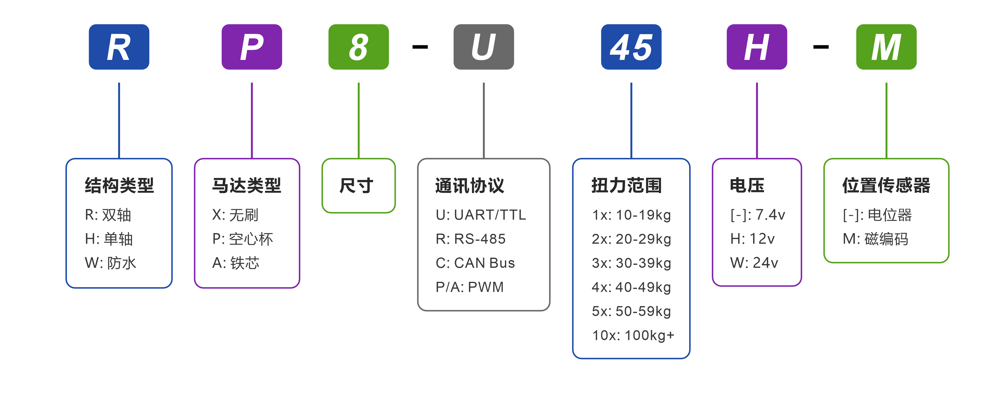

# 产品规格书 - HA8-U25-M / RA8-U25-M
---

<!--============ ##0.产品主图，中文用taobao，英文用simple，每个规格书一个主图 ===============================-->

<!-- 产品主图 -->




<!--============ ##1.产品特点，不同马达类型引用不同段落 ===============================-->

<!--start:spec-01-cored-->
## 1. 产品特点

- **UART 双向通信**，最高波特率 1 Mbps，支持位置与状态回读
- 12-bit 绝对值位置编码器（4,096 阶分辨率），可任意设定原点
- **多圈**角度最大控制范围 ±368,640°（1,024 圈），具备**断电角度记忆功能**
- 内置梯形加减速算法，实现平滑运动控制
- 提供**三种停止模式**：锁力保持 / 失锁释放 / 阻尼控制
- 集成温度、电压、堵转、功率、电流多重保护机制，具备智能功率限制功能
- 配套可视化上位机调试软件，支持**固件升级**

<!--end:spec-01-cored-->

<!--start:spec-01-bldc01-->
## 1. 产品特点

- 采用**无刷马达 / 不锈钢齿轮组 / 全金属外壳**设计
- **UART 双向通信**，最高波特率 1 Mbps，支持位置与状态回读
- 12-bit 绝对值位置编码器（4,096 阶分辨率），可任意设定原点
- **多圈**角度最大控制范围 ±368,640°（1,024 圈），具备**断电角度记忆功能**
- 内置梯形加减速算法，实现平滑运动控制
- 提供**三种停止模式**：锁力保持 / 失锁释放 / 阻尼控制
- 集成温度、电压、堵转、功率、电流多重保护机制，具备智能功率限制功能
- 配套可视化上位机调试软件，支持**固件升级**

<!--end:spec-01-bldc01-->

<!--start:spec-01-bldc02-->
## 1. 产品特点

- 采用**无刷马达 / 不锈钢齿轮组 / 全金属外壳**设计
- **RS485 双向通信**，最高波特率 1 Mbps，支持位置与状态回读
- 12-bit 绝对值位置编码器（4,096 阶分辨率），可任意设定原点
- **多圈**角度最大控制范围 ±368,640°（1,024 圈），具备**断电角度记忆功能**
- 内置梯形加减速算法，实现平滑运动控制
- 提供**三种停止模式**：锁力保持 / 失锁释放 / 阻尼控制
- 集成温度、电压、堵转、功率、电流多重保护机制，具备智能功率限制功能
- 配套可视化上位机调试软件，支持**固件升级**

<!--end:spec-01-bldc02-->

<!--spec-01-bldc03，HX8-U45H-M/RX8-U45H-M,HX8-U26H-M/RX8-U26H-M专用-->
<!--start:spec-01-bldc03-->
## 1. 产品特点

- 采用**无刷马达 / 不锈钢齿轮组**设计
- **UART 双向通信**，最高波特率 1 Mbps，支持位置与状态回读
- 12-bit 绝对值位置编码器（4,096 阶分辨率），可任意设定原点
- **多圈**角度最大控制范围 ±368,640°（1,024 圈），具备**断电角度记忆功能**
- 内置梯形加减速算法，实现平滑运动控制
- 提供**三种停止模式**：锁力保持 / 失锁释放 / 阻尼控制
- 集成温度、电压、堵转、功率、电流多重保护机制，具备智能功率限制功能
- 配套可视化上位机调试软件，支持**固件升级**

<!--end:spec-01-bldc03-->

<!--start:spec-01-pwm-cored-->
## 1. 产品特点

- 支持标准 **PWM 控制信号**，广泛兼容各类**单片机**、**舵机控制器**与**机器人开发平台**
- 内置高精度 **电位器位置反馈**，实现平滑、稳定的**闭环角度控制**
- 提供 **180° / 270°** 多种物理转角规格可选，适配差异化机构行程需求
- 支持 **6.0V ~ 8.4V** 宽幅电压输入，契合 **2S 锂电池**及常规稳压供电架构
- 采用业界标准 **25T 输出齿**，兼容通用舵盘、金属舵臂及结构配件
- 采用**加厚全金属齿轮组**，具备良好的**耐磨损**与**抗冲击**能力
- 采用**铝合金 CNC 中壳散热设计**，提升高负载下的**散热效率**

<!--end:spec-01-pwm-cored-->

<!--start:spec-01-pwm-coreless-->
## 1. 产品特点

- 支持标准 **PWM 控制信号**，广泛兼容各类**单片机**、**舵机控制器**与**机器人开发平台**
- 搭载高性能**空心杯电机**，具备更快的**响应速度**与更强的**扭矩输出**
- 内置高精度 **电位器位置反馈**，实现平滑、稳定的**闭环角度控制**
- 采用业界标准 **25T 输出齿**，兼容通用舵盘、金属舵臂及结构配件
- 内置高强度**加厚金属齿轮组**，具备良好的**耐磨损**与**抗冲击**能力
- 采用**铝合金 CNC 中壳散热设计**，提升高负载下的**散热效率**

<!--end:spec-01-pwm-coreless-->

<!--start:spec-01-pwm-brushless-->
## 1. 产品特点

- 支持标准 **PWM 控制信号**，广泛兼容各类**单片机**、**舵机控制器**与**机器人开发平台**
- 搭载高性能**无刷电机**，具备更快的**响应速度**、更高的**效率**与更长的**使用寿命**
- 内置高精度 **磁编码器位置反馈**，实现平滑、稳定的**闭环角度控制**
- 采用业界标准 **25T 输出齿**，兼容通用舵盘、金属舵臂及结构配件
- 内置高强度**加厚金属齿轮组**，具备良好的**耐磨损**与**抗冲击**能力
- 采用**铝合金 CNC 中壳散热设计**，提升高负载下的**散热效率**

<!--end:spec-01-pwm-brushless-->

<!--==================== ##2.型号定义，不同马达类型引用不同段落 ==========================-->

<!--start:spec-02-->
## 2. 型号定义

<!--end:spec-02-->

<!--============ ##3.规格参数，这个section没有引用，不同规格书和特性曲线各自填写 ============-->

<!--============ ##4.外观尺寸与安装，这个section没有引用，参考HA8-U25H-M进行填写======================-->

## 4. 外观尺寸与安装

**文件下载：**
[PDF](../cad-files/data/ha8-hp8-hx8-series-dimension.pdf){ ha8-hp8-hx8-series-dimension.pdf } ｜ 
[STEP](../cad-files/data/ha8-hp8-hx8-series-3D.STEP.zip){ ha8-hp8-hx8-series-3D.STEP.zip } ｜ 
[DWG](../cad-files/data/ha8-hp8-hx8-series-dimension.dwg.zip){ ha8-hp8-hx8-series-dimension.dwg.zip }｜ 
[更多配件图纸](../../parts/index.md)

<!--============ ##5.接口与连线，不同类型舵机引用不同段落 =============================-->

<!--start:spec-05-ph20-3pin-->
## 5. 接口与连线

{{ fig_center("../../../../snippets/datasheet/images/ph20-3pin.png", "引脚定义", "500px") }}

{{ fig_center("../../../../snippets/datasheet/images/ph20-3pin-serial.png", "串联", "500px") }}

{{ fig_center("../../../../snippets/datasheet/images/ph20-3pin-parallel.png", "并联", "500px") }}

<!--end:spec-05-ph20-3pin-->

<!--start:spec-05-ph20-3pin-d-->
## 5. 接口与连线

{{ fig_center("../../../../snippets/datasheet/images/ph20-3pin.png", "引脚定义", "500px") }}

{{ fig_center("../../../../snippets/datasheet/images/ph20-3pin-d-serial.png", "串联", "500px") }}

{{ fig_center("../../../../snippets/datasheet/images/ph20-3pin-d-parallel.png", "并联", "500px") }}

<!--end:spec-05-ph20-3pin-d-->

<!--start:spec-05-ph20-4pin-->
## 5. 接口与连线

{{ fig_center("../../../../snippets/datasheet/images/ph20-4pin.png", "引脚定义", "500px") }}

{{ fig_center("../../../../snippets/datasheet/images/ph20-4pin-serial.png", "串联", "500px") }}

{{ fig_center("../../../../snippets/datasheet/images/ph20-4pin-parallel.png", "并联", "500px") }}

<!--end:spec-05-ph20-4pin-->

<!--start:spec-05-ph20-4pin-d-->
## 5. 接口与连线

{{ fig_center("../../../../snippets/datasheet/images/ph20-4pin.png", "引脚定义", "500px") }}

{{ fig_center("../../../../snippets/datasheet/images/ph20-4pin-d-serial.png", "串联", "500px") }}

{{ fig_center("../../../../snippets/datasheet/images/ph20-4pin-d-parallel.png", "并联", "500px") }}

<!--end:spec-05-ph20-4pin-d-->

<!--start:spec-05-5264-3pin-->
## 5. 接口与连线

{{ fig_center("../../../../snippets/datasheet/images/5264-3pin.png", "引脚定义", "500px") }}

{{ fig_center("../../../../snippets/datasheet/images/5264-3pin-serial.png", "串联", "500px") }}

{{ fig_center("../../../../snippets/datasheet/images/5264-3pin-parallel.png", "并联", "500px") }}

<!--end:spec-05-5264-3pin-->

<!--start:spec-05-5264-3pin-d-->
## 5. 接口与连线

{{ fig_center("../../../../snippets/datasheet/images/5264-3pin.png", "引脚定义", "500px") }}

{{ fig_center("../../../../snippets/datasheet/images/5264-3pin-d-serial.png", "串联", "500px") }}

{{ fig_center("../../../../snippets/datasheet/images/5264-3pin-d-parallel.png", "并联", "500px") }}

<!--end:spec-05-5264-3pin-d-->

<!--start:spec-05-5264-4pin-->
## 5. 接口与连线

{{ fig_center("../../../../snippets/datasheet/images/5264-4pin.png", "引脚定义", "500px") }}

{{ fig_center("../../../../snippets/datasheet/images/5264-4pin-serial.png", "串联", "500px") }}

{{ fig_center("../../../../snippets/datasheet/images/5264-4pin-parallel.png", "并联", "500px") }}

<!--end:spec-05-5264-4pin-->

<!--start:spec-05-5264-4pin-d-->
## 5. 接口与连线

{{ fig_center("../../../../snippets/datasheet/images/5264-4pin.png", "引脚定义", "500px") }}

{{ fig_center("../../../../snippets/datasheet/images/5264-4pin-d-serial.png", "串联", "500px") }}

{{ fig_center("../../../../snippets/datasheet/images/5264-4pin-d-parallel.png", "并联", "500px") }}

<!--end:spec-05-5264-4pin-d-->

<!--start:spec-05-a2007-3pin-a-->
## 5. 接口与连线

{{ fig_center("../../../../snippets/datasheet/images/a2007-3pin-a.png", "引脚定义", "500px") }}

{{ fig_center("../../../../snippets/datasheet/images/a2007-3pin-a-serial.png", "串联", "500px") }}

{{ fig_center("../../../../snippets/datasheet/images/a2007-3pin-a-parallel.png", "并联", "500px") }}

<!--end:spec-05-a2007-3pin-a-->

<!--start:spec-05-a2007-3pin-b-->
## 5. 接口与连线

{{ fig_center("../../../../snippets/datasheet/images/a2007-3pin-b.png", "引脚定义", "500px") }}

{{ fig_center("../../../../snippets/datasheet/images/a2007-3pin-b-serial.png", "串联", "500px") }}

{{ fig_center("../../../../snippets/datasheet/images/a2007-3pin-b-parallel.png", "并联", "500px") }}

<!--end:spec-05-a2007-3pin-b-->

<!--start:spec-06-uart-->
## 6. 开发环境与SDK
提供覆盖主流控制板、语言与机器人框架的 SDK/示例工程，支持快速验证、功能开发与系统集成。

<table>
  <tr>
    <th width="200" align="left">平台/环境/语言</th>
    <th width="400" align="left">兼容型号/内容</th>
  </tr>
  <tr>
    <td><strong>Arduino</strong></td>
    <td>
      <ul>
        <li><a href="../../../../sdk/servo/arduino-uno-sdk/">Uno</a></li>
        <li><a href="../../../../sdk/servo/arduino-mega-2560-sdk/">Mega2560</a></li>
        <li><a href="../../../../sdk/servo/arduino-stm32f103c8t6-sdk/">STM32F103C8T6 Core</a></li>
        <li><a href="../../../../sdk/servo/mixly-sdk/">Mixly</a></li>
      </ul>
    </td>
  </tr>
  <tr>
    <td><strong>ESP32</strong></td>
    <td>
      <ul>
        <li><a href="../../../../sdk/servo/arduino-esp32-sdk/">NodeMCU-32S</a></li>
      </ul>
    </td>
  </tr>
  <tr>
    <td><strong>STM32</strong></td>
    <td>
      <ul>
        <li><a href="../../../../sdk/servo/stm32f103-sdk/">STM32F103 SDK</a></li>
        <li><a href="../../../../sdk/servo/stm32f407-sdk/">STM32F407 SDK</a></li>
      </ul>
    </td>
  </tr>
  <tr>
    <td><strong>树莓派（Python）</strong></td>
    <td>
      <ul>
        <li><a href="../../../../sdk/servo/python-sdk/">Pi 4B</a></li>
        <li><a href="../../../../sdk/servo/python-sdk/">Pi 5</a></li>
      </ul>
    </td>
  </tr>
  <tr>
    <td><strong>编程语言</strong></td>
    <td>
      <ul>
        <li><a href="../../../../sdk/servo/python-sdk/">Python</a></li>
        <li><a href="../../../../sdk/servo/micropython-sdk/">MicroPython</a></li>
        <li><a href="../../../../sdk/servo/cpp-sdk/">C++</a></li>
        <li><a href="../../../../sdk/servo/csharp-sdk/">C#</a></li>
      </ul>
    </td>
  </tr>
  <tr>
    <td><strong>机器人框架</strong></td>
    <td>
      <ul>
        <li><a href="../../../../sdk/servo/ros2-sdk/">ROS2</a></li>
      </ul>
    </td>
  </tr>
</table>

<!--end:spec-06-uart-->

<!--start:spec-06-rs485-->

## 6. PLC 应用 / 开发环境与SDK
提供覆盖主流 PLC 平台、控制板与编程语言的 SDK 和示例工程，支持快速验证、功能开发与系统集成。

<table>
  <tr>
    <th width="200" align="left">平台/环境/语言</th>
    <th width="400" align="left">兼容型号/内容</th>
  </tr>
  <tr>
    <td><strong>西门子（PLC）</strong></td>
    <td>
      <ul>
        <li><a href="../../../../industrial/plc/sinamics-tia-portal-v19/">TIA Portal v19（S7-1200）</a></li>
        <li><a href="../../../../industrial/plc/step7-microwin-smart/">STEP 7-MicroWIN SMART（S7-200 SMART）</a></li>
      </ul>
    </td>
  </tr>
  <tr>
    <td><strong>三菱（PLC）</strong></td>
    <td>
      <ul>
        <li><a href="../../../../industrial/plc/mitsubishi-gx-works2/">GX Works2（FX3U）</a></li>
      </ul>
    </td>
  </tr>
  <tr>
    <td><strong>汇川（PLC）</strong></td>
    <td>
      <ul>
        <li><a href="../../../../industrial/plc/inovance-inoproshop/">InoproShop（AM401）</a></li>
        <li><a href="../../../../industrial/plc/autoshop/">AutoShop（H5U）</a></li>
      </ul>
    </td>
  </tr>
  <tr>
    <td><strong>Codesys（PLC）</strong></td>
    <td>
      <ul>
        <li><a href="../../../../industrial/plc/codesys/">GCAN302</a></li>
      </ul>
    </td>
  </tr>
  <tr>
    <td><strong>STM32</strong></td>
    <td>
      <ul>
        <li><a href="../../../../sdk/servo/stm32f103-sdk/">STM32F103 SDK</a></li>
        <li><a href="../../../../sdk/servo/stm32f407-sdk/">STM32F407 SDK</a></li>
      </ul>
    </td>
  </tr>
  <tr>
    <td><strong>编程语言</strong></td>
    <td>
      <ul>
        <li><a href="../../../../sdk/servo/python-sdk/">Python</a></li>
        <li><a href="../../../../sdk/servo/micropython-sdk/">MicroPython</a></li>
        <li><a href="../../../../sdk/servo/cpp-sdk/">C++</a></li>
        <li><a href="../../../../sdk/servo/csharp-sdk/">C#</a></li>
      </ul>
    </td>
  </tr>
</table>

<!--end:spec-06-rs485-->

<!--start:spec-07/10-->
## 7. 保护功能
总线舵机集成温度、电压、堵转、功率、电流等多重保护机制，并可通过[状态标志位](../../uart/protocols/uart-rs485-protocol/#a)判断当前是否触发对应保护。

<table>
  <tr>
    <th>温度保护</th>
  </tr>
  <tr>
    <td>
      <ul style="margin: 0; padding-left: 1.2em;">
        <li><strong>触发</strong>：【工作温度】>【设定阈值】</li>
        <li><strong>动作</strong>：<strong>强制低功率运行</strong>，限制出力，维持基础运动</li>
        <li><strong>恢复</strong>：温度降至设定值 - 10℃ 时，<strong>自动恢复</strong></li>
      </ul>
    </td>
  </tr>
</table>

<table>
  <tr>
    <th>堵转保护</th>
  </tr>
  <tr>
    <td>
      <ul style="margin: 0; padding-left: 1.2em;">
        <li><strong>触发</strong>：【堵转失锁开关：<strong>ON</strong>】+【当前功率>保护阈值】</li>
        <li><strong>动作</strong>：<strong>自动释放锁力</strong>，防止电机长时间过载烧毁</li>
        <li><strong>恢复</strong>：无需断电，发送 <strong>停止指令</strong> 即可恢复工作</li>
      </ul>
    </td>
  </tr>
</table>

<table>
  <tr>
    <th>功率保护</th>
  </tr>
  <tr>
    <td>
      <ul style="margin: 0; padding-left: 1.2em;">
        <li><strong>触发</strong>：【堵转失锁开关：<strong>OFF</strong>】+【当前功率>保护阈值】</li>
        <li><strong>动作</strong>：<strong>限制运行功率</strong>，降至“堵转功率上限”运行</li>
        <li><strong>恢复</strong>：功率负载回落后，<strong>自动恢复</strong></li>
      </ul>
    </td>
  </tr>
</table>

<table>
  <tr>
    <th>电压保护</th>
  </tr>
  <tr>
    <td>
      <ul style="margin: 0; padding-left: 1.2em;">
        <li><strong>触发</strong>：【工作电压】超出【高/低压设定范围】</li>
        <li><strong>动作</strong>：<strong>自动释放锁力</strong>，无力矩输出，进入自由状态</li>
        <li><strong>恢复</strong>：<strong>必须重新上电</strong>，且电压恢复至正常区间</li>
      </ul>
    </td>
  </tr>
</table>

<table>
  <tr>
    <th>电流保护</th>
  </tr>
  <tr>
    <td>
      <ul style="margin: 0; padding-left: 1.2em;">
        <li><strong>触发</strong>：【工作电流】>【设定阈值】</li>
        <li><strong>动作</strong>：<strong>自动释放锁力</strong>，作为末端安全冗余保障</li>
        <li><strong>恢复</strong>：电流回落至阈值以下，<strong>自动恢复</strong></li>
      </ul>
    </td>
  </tr>
</table>

> [!WARNING]
> - 电压保护触发后，**必须断电并重新上电**，舵机才会恢复工作。
> - 堵转/功率/电流保护用于避免过载损坏，阈值设置过高可能导致保护失效。
> - 若频繁触发温度/电流保护，请降低负载或改善散热与供电。

> [!NOTE]
> - 温度保护的默认阈值为 70℃。
> - 电压保护的默认保护区间：**7.4V 版本**：6.0-8.4V / **12V 版本**：9.0-12.6V / **24V 版本**：20.0-25.2V。
> - 电流保护可与堵转/功率保护结合使用，当上位机未触发前两项逻辑时，电流保护作为硬件层级的最后保障。

## 8. 指令与协议

总线舵机采用 **UART/RS485 总线** 通讯协议，基于 **半双工异步串行通信** 机制，采用 **指令-响应** 的方式，实现主控与多舵机之间的控制指令下发、状态回读，并通过为每个舵机分配**唯一** ID 完成总线寻址与设备识别（**默认** ID = 0）。

### 8.1 控制指令

- 帧格式为 **8 位数据位 + 1 位停止位（无奇偶校验）**。
- `TxD` 与 `RxD` **不可同时工作**，任一时刻仅允许一个设备发送数据，其余设备需处于接收待命状态。
- 建议连续指令的发送间隔控制在 **5-10 ms**。

| 指令名称                    |   指令编号    | 响应封包类型 |
| --------------------------- | :-----------: | :------------: |
| [通讯检测](../../uart/protocols/uart-rs485-protocol/#cmd-01)                    | **01** (0x01) | 固定         |
| [简易单圈角度控制](../../uart/protocols/uart-rs485-protocol/#cmd-08)            | **08** (0x08) | 可配置         |
| [高级单圈角度控制 (基于时间)](../../uart/protocols/uart-rs485-protocol/#cmd-11) | **11** (0x0B) | 可配置         |
| [高级单圈角度控制 (基于速度)](../../uart/protocols/uart-rs485-protocol/#cmd-12) | **12** (0x0C) | 可配置         |
| [单圈角度读取](../../uart/protocols/uart-rs485-protocol/#cmd-10)            | **10** (0x0A) | 固定         |
| [简易多圈角度控制](../../uart/protocols/uart-rs485-protocol/#cmd-13)            | **13** (0x0D) | 可配置         |
| [高级多圈角度控制 (基于时间)](../../uart/protocols/uart-rs485-protocol/#cmd-14) | **14** (0x0E) | 可配置         |
| [高级多圈角度控制 (基于速度)](../../uart/protocols/uart-rs485-protocol/#cmd-15) | **15** (0x0F) | 可配置         |
| [多圈角度读取](../../uart/protocols/uart-rs485-protocol/#cmd-16)            | **16** (0x10) | 固定         |
| [重置圈数](../../uart/protocols/uart-rs485-protocol/#cmd-17)                    | **17** (0x11) | 可配置         |
| [阻尼控制](../../uart/protocols/uart-rs485-protocol/#cmd-09)                    | **09** (0x09) | 可配置         |
| [停止指令](../../uart/protocols/uart-rs485-protocol/#cmd-24)                    | **24** (0x18) | 可配置         |
| [同步指令](../../uart/protocols/uart-rs485-protocol/#cmd-25)                    | **25** (0x19) | 无           |
| [异步写入指令](../../uart/protocols/uart-rs485-protocol/#cmd-18)                | **18** (0x12) | 无           |
| [异步执行指令](../../uart/protocols/uart-rs485-protocol/#cmd-19)                | **19** (0x13) | 无           |
| [数据读取](../../uart/protocols/uart-rs485-protocol/#cmd-03)                    | **03** (0x03) | 固定         |
| [数据监控](../../uart/protocols/uart-rs485-protocol/#cmd-22)                    | **22** (0x16) | 固定         |
| [设置原点](../../uart/protocols/uart-rs485-protocol/#cmd-23)                    | **23** (0x17) | 可配置         |
| [自定义配置参数](../../uart/protocols/uart-rs485-protocol/#cmd-04)              | **04** (0x04) | 可配置         |

> [!NOTE]
> 默认设置下，舵机在执行指令时若收到新指令，会立即中断当前指令并优先执行新指令，原指令不再继续。

### 8.2 指令封包

**指令封包**是主控向舵机下发控制或查询命令时所使用的标准数据结构。

- **header：** 固定为 `0x12 0x4C`，用于标识指令封包的起始位置。
- **cmd_id：** 本次封包的控制指令
- **length：** 表示后续数据内容 (content) 的字节数，用于解析封包。

- **content：** 根据命令字不同，存放控制参数 (如舵机 ID、目标角度、运动时间、功率值等) 。
- **checksum：** 所有字节累加求和后取模 256 的结果，用于校验数据完整性。

### 8.3 响应封包

**响应封包**是舵机接收**指令封包**并校验通过后，解析参数并向主控返回执行结果与相关数据的标准数据结构。

其总体结构与指令封包一致，仅起始位置标识位和数据内容定义有所区别。

- **header：** 固定为 `0x05 0x1C`，用于标识响应封包的起始位置。  
- **cmd_id：** 本次封包的控制指令  
- **length：** 表示后续数据内容 (content) 的字节数，用于解析封包。  

- **content：** 根据命令字不同，返回执行结果，或相应数据 (如当前角度、电压、温度、版本、回读参数等) 。  
- **checksum：** 所有字节累加求和后取模 256 的结果，用于校验数据完整性。  

## 9. 运动与控制指令

### 9.1 通讯检测

通过发送目标 ID 的通讯检测指令，依据响应封包判断舵机是否在线。

<table>
  <tr>
    <th width="140" align="center">指令ID</th>
    <th width="300" align="left">指令名称</th>
    <th width="460" align="left">说明</th>
  </tr>
  <tr>
    <td align="center">01 (0x01)</td>
    <td>通讯检测</td>
    <td>响应封包 = 在线设备 ID</td>
  </tr>
</table>

### 9.2 单圈角度控制

- 支持基于时间或速度两类控制方式，并可通过单圈角度读取指令获取当前位置。
- 控制范围为 ±180°，最小控制精度 0.1°。  

<table>
  <tr>
    <th width="140" align="center">指令ID</th>
    <th width="300" align="left">指令名称</th>
    <th width="460" align="left">参数</th>
  </tr>
  <tr>
    <td align="center">08 (0x08)</td>
    <td>简易单圈角度控制</td>
    <td>目标角度、运动时间、运行功率</td>
  </tr>
  <tr>
    <td align="center">11 (0x0B)</td>
    <td>高级单圈角度控制（基于时间）</td>
    <td>目标角度、运动时间、加速时间、减速时间、运行功率</td>
  </tr>
  <tr>
    <td align="center">12 (0x0C)</td>
    <td>高级单圈角度控制（基于速度）</td>
    <td>目标角度、运动速度、加速时间、减速时间、运行功率</td>
  </tr>
  <tr>
    <td align="center">10 (0x0A)</td>
    <td>单圈角度读取</td>
    <td>响应封包 = 舵机当前角度</td>
  </tr>
</table>

{{ fig_center("../../../../snippets/datasheet/images/velocity-profile.png", "梯形加减速", "500px") }}

### 9.3 多圈角度控制

- 支持基于时间或速度两类控制方式，并可通过多圈角度读取指令获取当前位置。
- 控制范围为 ±368,640°（±1,024圈），最小控制精度 0.1°。  

<table>
  <tr>
    <th width="140" align="center">指令ID</th>
    <th width="300" align="left">指令名称</th>
    <th width="460" align="left">参数</th>
  </tr>
  <tr>
    <td align="center">13 (0x0D)</td>
    <td>简易多圈角度控制</td>
    <td>目标角度、运动时间、运行功率</td>
  </tr>
  <tr>
    <td align="center">14 (0x0E)</td>
    <td>高级多圈角度控制（基于时间）</td>
    <td>目标角度、运动时间、加速时间、减速时间、运行功率</td>
  </tr>
  <tr>
    <td align="center">15 (0x0F)</td>
    <td>高级多圈角度控制（基于速度）</td>
    <td>目标角度、运动速度、加速时间、减速时间、运行功率</td>
  </tr>
  <tr>
    <td align="center">16 (0x10)</td>
    <td>多圈角度读取</td>
    <td>响应封包 = 舵机当前角度</td>
  </tr>
</table>

{{ fig_center("../../../../snippets/datasheet/images/velocity-profile.png", "梯形加减速", "500px") }}

### 9.4 圈数重置 / 断电记忆

#### 圈数重置

- 舵机处于释放锁力状态时，可通过上位机或指定指令来重置圈数，将当前**绝对位置**的角度重新记录为当前角度。
- 重置后初始角度落在 -180° 至 +180° 区间。

<table>
  <tr>
    <th width="140" align="center">指令ID</th>
    <th width="300" align="left">指令名称</th>
    <th width="460" align="left">说明</th>
  </tr>
  <tr>
    <td align="center">17 (0x11)</td>
    <td>重置圈数</td>
    <td>-</td>
  </tr>
</table>

{{ fig_center("../../../../snippets/datasheet/images/multi-turns-reset.png", "圈数重置", "500px") }}

> [!NOTE]
> 如图所示，A1 点当前角度为 6,880°，重设后的角度为 θ1；A2 点当前角度为 6,800°，重设后的角度为 -θ2。

#### 断电角度记忆

- 断电后，若伺服舵机的**角度未发生变化**，则上电后读取的当前角度值保持不变。（例如：A 点为断电前的角度位置 6,800°，断电期间角度未改变，舵机仍停留在 A 点，则上电后读取的角度仍为 6,800°。）
- 断电后，若由于外力作用导致**舵机角度发生变化**，则再次上电后读取到的角度值将落在记忆角度 ±180° 的范围内。

{{ fig_center("../../../../snippets/datasheet/images/power-down-memory.png", "断电角度记忆", "500px") }}

> [!NOTE]
> 如图所示，A 点为断电前的角度 6,800°。若断电期间舵机被外力转动，最终停在 B1 点，则上电后读取角度为 6,920°；若停在 B2 点，则读取角度为 6,680°。

### 9.5 阻尼模式
允许伺服舵机在外部力作用下调整到不同的角度位置，同时保持一定的阻尼效果，阻尼系数可自定义。
<table>
  <tr>
    <th width="140" align="center">指令ID</th>
    <th width="300" align="left">指令名称</th>
    <th width="460" align="left">参数</th>
  </tr>
  <tr>
    <td align="center">09 (0x09)</td>
    <td>阻尼控制</td>
    <td>执行功率（单位 mW）</td>
  </tr>
</table>

### 9.6 停止指令

- 可以根据不同运动控制需要，选择合适的停止指令类型，具体类型详见下表。
- 停止指令也可用于舵机在堵转保护触发后恢复正常工作状态。
- 当舵机处于失锁状态时，发送“保持锁力”指令可使其从当前位置重建锁力。

<table>
  <tr>
    <th width="140" align="center">指令ID</th>
    <th width="300" align="left">指令名称</th>
    <th width="460" align="left">说明</th>
  </tr>
  <tr>
    <td align="center">24 (0x18)</td>
    <td>失去锁力</td>
    <td>停止运动，并<strong>释放</strong>锁力。</td>
  </tr>
  <tr>
    <td align="center">24 (0x18)</td>
    <td>保持锁力</td>
    <td>停止运动，并<strong>维持</strong>锁力，或在无锁力状态恢复锁力。</td>
  </tr>
  <tr>
    <td align="center">24 (0x18)</td>
    <td>保持阻尼</td>
    <td>停止运动，并进入阻尼模式，外力可以调整角度。</td>
  </tr>
</table>

### 9.7 同步指令

- 单条指令同时包含多个伺服舵机的控制指令，适用于多个舵机协同动作的场景。
- 每个伺服舵机通过唯一的 ID 与指令内容中的参数进行匹配，仅解析并响应与自身 ID 相关的控制信息。
- 所有伺服舵机接收完指令后，将同时开始执行各自的指令，实现同步动作效果。

<table>
  <tr>
    <th width="140" align="center">指令ID</th>
    <th width="300" align="left">指令名称</th>
    <th width="460" align="left">说明</th>
  </tr>
  <tr>
    <td align="center">25 (0x19)</td>
    <td>同步指令</td>
    <td>-</td>
  </tr>
</table>

### 9.8 异步指令

- 异步指令由**异步写入指令**和**异步执行指令**两部分组成。
- 已暂存的运动指令，在未重新写入或未断电的情况下将持续保留，不会因其他指令的运行而被覆盖或清除。
- 异步指令被触发执行后，相关参数将被自动清除，不再保留。

<table>
  <tr>
    <th width="140" align="center">指令ID</th>
    <th width="300" align="left">指令名称</th>
    <th width="460" align="left">说明</th>
  </tr>
  <tr>
    <td align="center">18 (0x12)</td>
    <td>异步写入指令</td>
    <td>将目标运动指令写入舵机寄存器暂存，不立即执行。</td>
  </tr>
  <tr>
    <td align="center">19 (0x13)</td>
    <td>异步执行指令</td>
    <td>统一触发已暂存的异步运动指令，实现多舵机同步执行。</td>
  </tr>
</table>

### 9.9 状态读取 / 数据监控

用于获取舵机运行状态与关键参数，便于调试、巡检和上位机实时显示。

<table>
  <tr>
    <th width="140" align="center">指令ID</th>
    <th width="300" align="left">指令名称</th>
    <th width="460" align="left">说明</th>
  </tr>
  <tr>
    <td align="center">03 (0x03)</td>
    <td>数据读取</td>
    <td>单个读取舵机状态参数或配置参数，返回对应参数值。</td>
  </tr>
  <tr>
    <td align="center">22 (0x16)</td>
    <td>数据监控</td>
    <td>返回完整状态数据，包含电压、电流、功率、温度、状态位、角度与圈数等信息。</td>
  </tr>
</table>

### 9.10 设置原点

用于将舵机当前位置设为原点，常用于装配后的零位校准，并为控制算法提供统一的运动起始参考。

<table>
  <tr>
    <th width="140" align="center">指令ID</th>
    <th width="300" align="left">指令名称</th>
    <th width="460" align="left">参数</th>
  </tr>
  <tr>
    <td align="center">23 (0x17)</td>
    <td>设置原点</td>
    <td>舵机 ID / reset = 0 </td>
  </tr>
</table>

## 10. 更多资源

- **[调试转接板](../../parts/index.md)**

    用于连接总线舵机与 PC 或其他主控板，实现通信调试与数据交互。

 - **[PC 调试软件](../../../software/servo/pc-config-software)**
 
     提供ID修改、各种工作模式的实时控制、参数配置、状态监测与固件升级等功能。

- **[工程技术文档](../../documents/index.md)**

     涵盖通信协议、控制逻辑、参数配置与常见问题排查等工程实践内容。    

<!--end:spec-07/10-->
